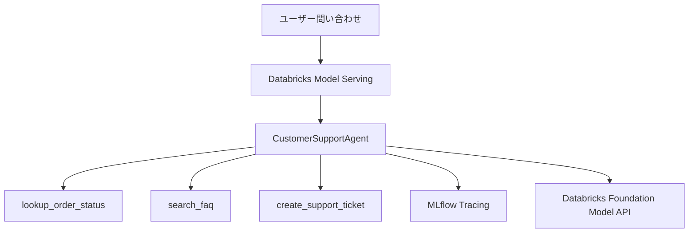

# Databricks AgentOps Customer Support Agent

Zenn記事「Databricks Model ServingでAgentOpsの評価・監視・改善ループを実装する」で使用する、カスタマーサポートAIエージェントのサンプルリポジトリです。

- Zenn: https://zenn.dev/aymkbyshi/articles/a4fbea113c315e
- Notebook: [`notebooks/customer_support_agent.py`](notebooks/customer_support_agent.py)
- Zenn記事Markdown: [`articles/databricks-agentops-zenn.md`](articles/databricks-agentops-zenn.md)

## このリポジトリで試せること

公開Notebookでは、次のベース実装を上から順に実行できます。

- LangGraphによるツール実行型AIエージェント
- MLflow `ResponsesAgent`
- 専用一時ファイルと`importlib`による明示的なコード読み込み
- MLflow Tracingによるツール選択・引数・戻り値の確認
- Unity Catalogへのモデル登録
- Databricks Model Servingへのデプロイ
- Endpointの更新完了待ちとREADY確認
- デプロイ済みEndpointへの問い合わせ

記事では、このベース実装に加えて次のAgentOps設計とコード例を解説します。

- 評価データセット
- 5つのScorer
- 品質ゲート
- Production Monitoring
- 低品質候補Traceを人手レビューへ戻す改善ループ

> **スコープについて**  
> 公開Notebookは、エージェント構築、登録、デプロイ、Trace確認までの実行可能なベース実装です。評価データセット、品質ゲート、Production Monitoring、改善ループは記事中のコード例を基に、利用環境とMLflow APIのバージョンに合わせて追加してください。

## 2026年7月現在の推奨経路

このサンプルは、MLflow `ResponsesAgent`をUnity Catalogへ登録し、Databricks Model Servingへデプロイする方式を扱います。

Databricksは新規エージェント開発ではDatabricks AppsベースのCustom Agentを推奨しています。このリポジトリは、AgentOpsの主要要素をNotebookで理解する教材、既存のModel Serving環境、またはAppsを利用できない環境向けです。

- 公式ドキュメント: https://docs.databricks.com/aws/en/agents/agent-framework/migrate-agent-to-apps

## アーキテクチャ



## 実行方法

1. `notebooks/customer_support_agent.py`をDatabricks Workspaceへインポートします。
2. `CATALOG`と`SCHEMA`を自分の環境に合わせて変更します。
3. `LLM_ENDPOINT`が利用可能か確認します。
4. Notebookを上から順に実行します。
5. MLflow Trace、Unity Catalog、Model Servingを確認します。

## Databricksへのインポート

Databricks Workspaceで次の操作を行います。

1. **Workspace**を開く
2. **Import**を選択
3. `notebooks/customer_support_agent.py`をアップロード
4. Notebookを開き、設定セルを変更して実行

## Production Monitoringについて

2026年7月現在、MLflow 3 Production MonitoringはBetaです。ワークスペースのPreview設定、Serverless budget policy、SQL Warehouseなど、利用環境に応じた前提条件を公式ドキュメントで確認してください。

- 公式ドキュメント: https://docs.databricks.com/aws/en/mlflow3/genai/eval-monitor/production-monitoring

## 注意事項

- 注文情報、FAQ、サポートチケットはデモ用のモックです。
- 本番ではAuroraや既存API、検索基盤などへ差し替えてください。
- 注文検索では、認証済み顧客IDと注文の所有権を必ず検証してください。
- 更新系ツールには確認・承認フローと冪等性を追加してください。
- 個人情報や機密情報をMLflow Traceへ記録しないようにしてください。
- Traceの閲覧権限と保存期間を設定してください。
- パッケージのバージョンは、利用中のDatabricks Runtimeとの互換性を確認してください。

## ファイル構成

```text
.
├── README.md
├── LICENSE
├── .gitignore
├── articles/
│   └── databricks-agentops-zenn.md
├── notebooks/
│   └── customer_support_agent.py
└── images/
    └── README.md
```

## License

MIT License
