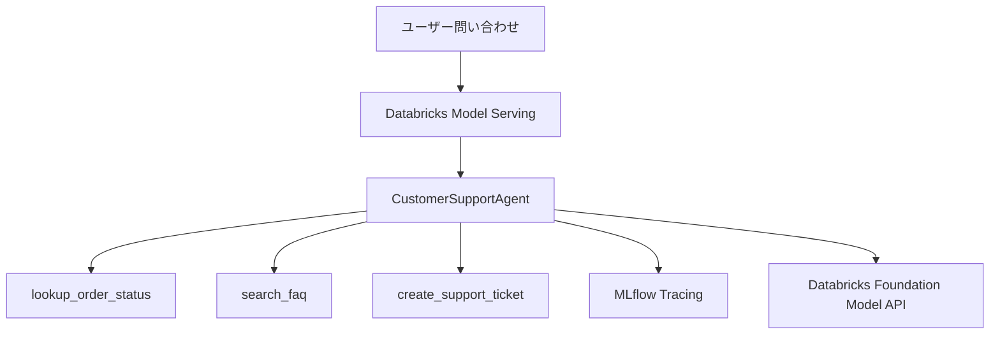

# Databricks AgentOps Customer Support Agent

Zenn記事「DatabricksでAgentOpsを体験する」で使用した、カスタマーサポートAIエージェントのサンプルです。

- Zenn: https://zenn.dev/aymkbyshi/articles/a4fbea113c315e
- Notebook: [`notebooks/customer_support_agent.py`](notebooks/customer_support_agent.py)
- Zenn記事Markdown: [`articles/databricks-agentops-zenn.md`](articles/databricks-agentops-zenn.md)

## このサンプルで試せること

- LangGraphによるツール実行型AIエージェント
- MLflow `ResponsesAgent`
- MLflow Tracingによるツール選択・引数・戻り値の確認
- Unity Catalogへのモデル登録
- Databricks Model Servingへのデプロイ
- Review AppとAPIからの動作確認

## アーキテクチャ



## 実行方法

1. `notebooks/customer_support_agent.py`をDatabricks Workspaceへインポートします。
2. `CATALOG`と`SCHEMA`を自分の環境に合わせて変更します。
3. `LLM_ENDPOINT`が利用可能か確認します。
4. Notebookを上から順に実行します。
5. MLflow Trace、Unity Catalog、Model Serving、Review Appを確認します。

## Databricksへのインポート

Databricks Workspaceで次の操作を行います。

1. **Workspace**を開く
2. **Import**を選択
3. `notebooks/customer_support_agent.py`をアップロード
4. Notebookを開き、設定セルを変更して実行

## 公開用記事

`articles/databricks-agentops-zenn.md`は、Zennへ貼り付けられる完成版のMarkdownです。

画像パスは次を想定しています。

```text
/images/databricks-agentops/trace-list.png
/images/databricks-agentops/trace-detail.png
```

## 注意事項

- 注文情報、FAQ、サポートチケットはデモ用のモックです。
- 本番ではAuroraや既存API、検索基盤などへ差し替えてください。
- 注文検索では、認証済み顧客IDと注文の所有権を必ず検証してください。
- 更新系ツールには確認・承認フローと冪等性を追加してください。
- 個人情報や機密情報をMLflow Traceへ記録しないようにしてください。
- Traceの閲覧権限と保存期間を設定してください。
- パッケージのバージョンは、利用中のDatabricks Runtimeとの互換性を確認してください。

## ファイル構成

```text
.
├── README.md
├── LICENSE
├── .gitignore
├── articles/
│   └── databricks-agentops-zenn.md
├── notebooks/
│   └── customer_support_agent.py
└── images/
    └── README.md
```

## License

MIT License
