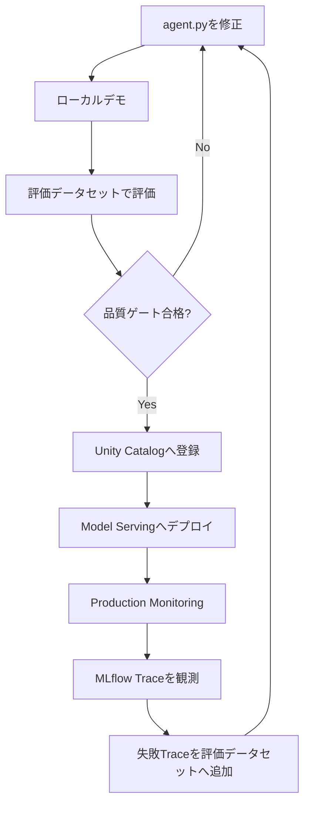
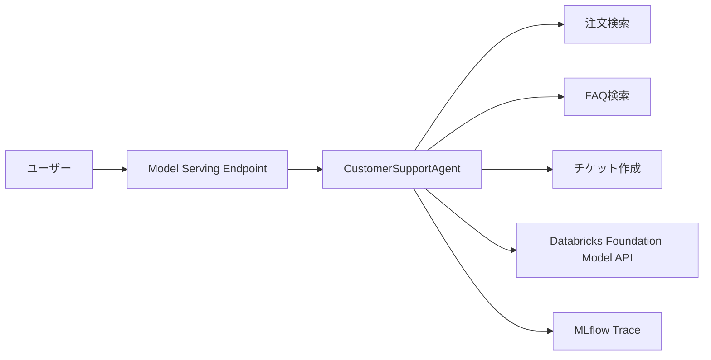
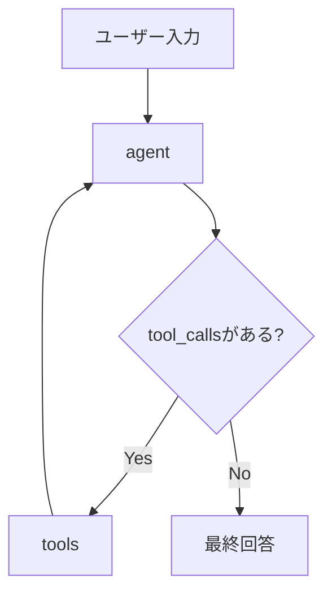
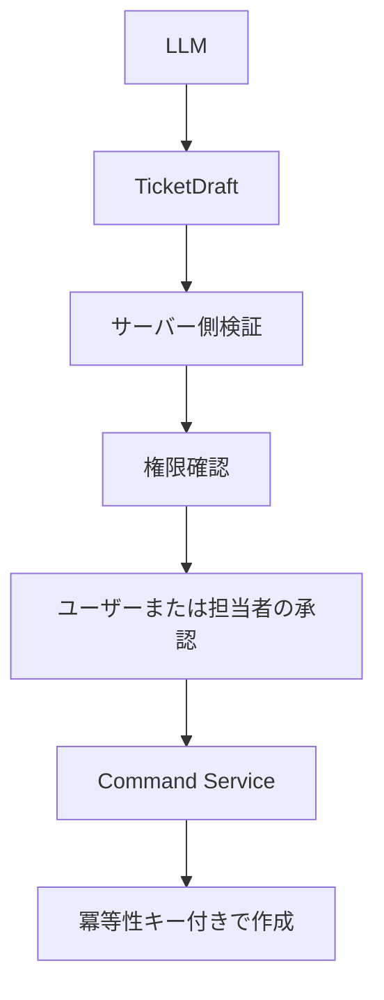

## はじめに

AIエージェントを作るだけなら、以前より簡単になりました。

しかし、実際に運用するには「回答が返った」だけでは足りません。少なくとも、次の問いに答えられる必要があります。

- どのツールを呼び出したか
- ツールへどの引数を渡したか
- ツールから何が返ったか
- デプロイ前の品質基準を満たしたか
- 本番で品質が下がっていないか
- 失敗した実行を次の改善へ取り込めるか

本記事では、カスタマーサポートAIエージェントを題材に、次のループをDatabricks上で体験します。



:::message alert
2026年7月現在、Databricksは新規エージェント開発について、Databricks AppsベースのCustom Agentを推奨しています。本記事は、ResponsesAgentをUnity Catalogへ登録し、Model Servingへデプロイする従来方式を扱います。既存環境、学習目的、Apps未提供リージョン向けの選択肢として読んでください。
:::

Databricks Appsを使う新規構成では、Gitベースのバージョン管理、Declarative Automation Bundles、`uv.lock`、ローカル開発、CI/CD、カスタムミドルウェアなどを利用できます。

https://docs.databricks.com/aws/en/agents/agent-framework/migrate-agent-to-apps

## サンプルNotebook

この記事で使用するDatabricks NotebookはGitHubで公開しています。

Databricks Workspaceへインポートし、`CATALOG`、`SCHEMA`、`LLM_ENDPOINT`を自分の環境に合わせて変更してください。

https://github.com/aymkbyshi/databricks-agentops-customer-support

## この記事で扱うAgentOpsの範囲

今回実装するのは、単なるTracingとデプロイだけではありません。

| フェーズ | 実装内容 |
| --- | --- |
| 開発 | LangGraphとMLflow ResponsesAgent |
| 観測 | MLflow Tracing |
| 評価 | Unity Catalog上の評価データセットとScorer |
| 品質ゲート | 閾値未達時に`RuntimeError`で停止 |
| 登録 | MLflow ModelとUnity Catalog |
| デプロイ | Databricks Model Serving |
| 本番監視 | Production Monitoringによる自動採点 |
| 改善 | 失敗Traceを評価データセットへ追加 |

ただし、本番向けの完全な設計ではありません。特に、副作用ツールの承認、PIIマスキング、認可、間接プロンプトインジェクション対策は、サンプルより強い実装が必要です。

## 作るエージェント

エージェントには3つのツールを用意します。

| ツール | 役割 |
| --- | --- |
| `lookup_order_status` | 注文番号から配送状況を確認 |
| `search_faq` | 返品、配送、支払い、保証などを検索 |
| `create_support_ticket` | 解決できない問い合わせのチケットを作成 |

全体構成は次のとおりです。



デモでは注文、FAQ、チケットをPythonのモックとして実装します。既存のAuroraや業務APIを置き換える必要はありません。本番ではツール内部だけを既存システムへ接続します。

## 1. 実行環境を準備する

Notebookでは、動作確認した直接依存を固定しています。

```python
%pip install -U \
    mlflow==3.6.0 \
    databricks-langchain==0.8.2 \
    langgraph==0.3.4 \
    langchain-core==0.3.86 \
    databricks-agents \
    pydantic==2.12.5 \
    -q

dbutils.library.restartPython()
```

:::message
この固定は完全な再現性を保証するlockfileではありません。新規のDatabricks Apps構成では、`pyproject.toml`と`uv.lock`を使う方が適しています。
:::

再現性を説明する際は、パッケージだけでなく、Databricks Runtime、Python、クラウド、リージョン、ServerlessまたはClassic、実行確認日も記録するのが望ましいです。

## 2. MLflow Experimentと評価データセット名を設定する

```python
CATALOG = "main"
SCHEMA = "your_schema"

MODEL_NAME = f"{CATALOG}.{SCHEMA}.customer_support_agent"
EVAL_DATASET_NAME = f"{CATALOG}.{SCHEMA}.customer_support_eval"

AGENT_ENDPOINT_NAME = "customer-support-agent"
LLM_ENDPOINT = "databricks-meta-llama-3-3-70b-instruct"
```

ローカル実行、評価、モデル登録、本番Traceを同じExperimentへ集約します。

```python
MLFLOW_EXPERIMENT_NAME = (
    f"/Users/{username}/customer-support-agent"
)

mlflow.set_experiment(MLFLOW_EXPERIMENT_NAME)
```

## 3. `agent.py`を自己完結ファイルとして作る

Notebook内で`/tmp/agent.py`を書き出します。

```python
%%writefile /tmp/agent.py
```

エージェント本体は、`ResponsesAgent`とLangGraphで構築します。



グラフはリクエストごとに作らず、初期化時に一度だけ構築します。

```python
class CustomerSupportAgent(ResponsesAgent):
    def __init__(self):
        self.tools = [
            lookup_order_status,
            search_faq,
            create_support_ticket,
        ]
        self.llm = ChatDatabricks(
            endpoint=LLM_ENDPOINT,
            temperature=0.1,
            max_tokens=2000,
        )
        self.llm_with_tools = self.llm.bind_tools(self.tools)
        self.graph = self._build_graph()
```

ツールループには`recursion_limit`を設定します。

```python
for event in self.graph.stream(
    {"messages": messages},
    stream_mode=["updates"],
    config={"recursion_limit": 10},
):
    ...
```

これは無限ループ対策の一部にすぎません。本番では、LLM・ツール・リクエスト全体のタイムアウト、最大ツール回数、レート制限、費用上限、Circuit Breakerも必要です。

## 4. ローカル実行は「テスト」ではなく「デモ」

Notebookの`demo_agent()`は、回答を表示するだけです。

```python
demo_agent(
    "注文ORD-001の配送状況を教えてください"
)

demo_agent(
    "返品ポリシーを教えてください"
)

demo_agent(
    "商品に不具合があります。"
    "TEST-USER-001として"
    "サポートチケットの作成をお願いします"
)
```

実名ではなく、合成IDを使用します。

:::message alert
`demo_agent()`は自動テストではありません。期待したツール、引数、呼び出し回数、禁止アクション、最終回答の事実集合を検証していないためです。
:::

本格的な自動テストでは、たとえば次を検証します。

```python
assert selected_tools == ["lookup_order_status"]
assert tool_args["order_id"] == "ORD-001"
assert created_ticket_count == 0
assert "2026-07-20" in final_answer
```

自然言語の完全一致ではなく、構造化された事実とアクションを検証対象にします。

## 5. 評価データセットと品質ゲート

今回の改善で最も重要なのが、デプロイ前評価です。

評価データセットはUnity Catalogに保存し、入力と期待値を持たせます。

```text
inputs
  input:
    - role: user
      content: 注文ORD-001の配送状況を教えてください

expectations
  expected_facts:
    - ノートPC
    - 配送中
    - 2026-07-20
```

評価には`mlflow.genai.evaluate()`を使います。

```python
gate_results = mlflow.genai.evaluate(
    data=dataset,
    predict_fn=_predict_fn,
    scorers=[
        expected_facts_present,
        Guidelines(
            name="japanese_response",
            guidelines=[
                "回答が必ず日本語で書かれていること"
            ],
        ),
        Guidelines(
            name="no_hallucination",
            guidelines=[
                "注文情報は注文検索ツールの結果のみを根拠にすること",
                "未確認情報を断定しないこと",
            ],
        ),
    ],
)
```

品質閾値を定義します。

```python
QUALITY_THRESHOLDS = {
    "expected_facts_present/mean": 0.80,
    "japanese_response/mean": 1.00,
    "no_hallucination/mean": 0.60,
}
```

未達なら例外を発生させ、後続の登録・デプロイを止めます。

```python
if failing:
    raise RuntimeError(
        "品質ゲート不合格。"
        "agent.pyを修正して再評価してください。"
    )
```

これにより、品質評価が説明だけで終わらず、デプロイフローに接続されます。

:::message
記事中の閾値はデモ用です。実運用では、分母、データの代表性、ラベル付与方法、重大度、信頼区間、誤検知コストを定義してください。特に情報漏洩や不正な更新操作は、平均値ではなく許容件数ゼロとして扱うべきです。
:::

## 6. Unity Catalogへ登録する

品質ゲートを通過したエージェントだけをMLflowへ記録します。

```python
with mlflow.start_run(
    run_name="customer-support-agent"
):
    model_info = mlflow.pyfunc.log_model(
        name="agent",
        python_model="/tmp/agent.py",
        resources=resources,
        pip_requirements=[
            "mlflow==3.6.0",
            "databricks-langchain==0.8.2",
            "langgraph==0.3.4",
            "langchain-core==0.3.86",
            "pydantic==2.12.5",
        ],
        input_example=input_example,
        registered_model_name=MODEL_NAME,
    )
```

登録されるのは、コードだけではありません。

- Pythonモデル
- 入力例
- 直接依存
- 利用するDatabricksリソース
- MLflow Run
- Unity Catalog上のモデルバージョン

## 7. Model Servingへデプロイする

```python
deploy_info = agents.deploy(
    model_name=MODEL_NAME,
    model_version=(
        model_info.registered_model_version
    ),
    endpoint_name=AGENT_ENDPOINT_NAME,
)
```

モデルバージョンを固定値にせず、今回登録されたバージョンを使います。

Endpointが`READY`にならない場合は、例外でNotebookを停止します。

```python
raise TimeoutError(
    f"Endpointが{timeout_min}分以内に"
    "READYになりませんでした"
)
```

`False`を返すだけでは、次のセルで未準備のEndpointを呼び出す可能性があるためです。

## 8. Production Monitoringで本番Traceを採点する

MLflow Production Monitoringでは、Experimentへ届くTraceをサンプリングし、Scorerを自動実行できます。

:::message alert
Production Monitoringは2026年7月時点でBetaです。利用にはWorkspaceのPreview設定が必要な場合があります。
:::

サンプルでは、日本語回答を100%、ハルシネーション確認を50%で採点します。

```python
_start_monitoring_scorer(
    Guidelines(
        name="prod_japanese_response",
        guidelines=[
            "回答が必ず日本語で書かれていること"
        ],
    ),
    scorer_name="prod_japanese_response",
    sample_rate=1.0,
)

_start_monitoring_scorer(
    Guidelines(
        name="prod_no_hallucination",
        guidelines=[
            "注文情報は注文検索ツールの結果のみを根拠にすること",
            "未確認情報を断定しないこと",
        ],
    ),
    scorer_name="prod_no_hallucination",
    sample_rate=0.5,
)
```

開発時と本番で同じ評価観点を使えるため、リリース前後の品質を一貫して観測できます。

## 9. MLflow Traceで実行経路を見る

Trace一覧では、リクエスト、レスポンス、トークン、レイテンシー、状態を確認できます。


*複数の実行について、入力、出力、トークン、レイテンシー、状態を一覧で確認する*

詳細画面では、Spanツリーと入出力を確認します。


*lookup_order_statusが選択され、ORD-001が渡され、結果を経由して最終回答へ到達したことを確認する*

Traceからわかるのは、モデル内部の思考理由ではありません。

正確には、次を観測できます。

- 受け取った入力
- 呼び出したツール
- ツール引数
- ツール結果
- 実行順序
- レイテンシー
- 最終出力

つまり「なぜ考えたか」ではなく、**どの入力・ツール・データを経由して回答へ到達したか**です。

Groundednessを検証するには、Traceを見るだけでなく、ツール結果と最終回答の主張を比較するScorerが必要です。

## 10. 失敗Traceを評価データセットへ戻す

AgentOpsのループを閉じるため、直近のTraceから失敗候補を抽出します。

サンプルでは、回答が空、または極端に短いTraceを失敗候補とします。

```python
if len(answer.strip()) < 5:
    failure_records.append(
        {
            "inputs": {"input": input_messages},
            "expectations": {
                "expected_facts": [],
                "expected_tool_calls": [],
                "note": "AUTO: 人手ラベルが必要",
            },
        }
    )
```

その後、評価データセットへ追加します。

```python
dataset = get_dataset(
    name=EVAL_DATASET_NAME
)

dataset.merge_records(
    failure_records
)
```

追加されたレコードは、そのまま正解データにはしません。

1. 人間がTraceを確認する
2. `expected_facts`と`expected_tool_calls`を付ける
3. `agent.py`を修正する
4. 品質ゲートを再実行する
5. 合格したバージョンだけをデプロイする

この流れで、失敗した本番入力を回帰テストへ変換できます。

## セキュリティ上の重要な注意

### プロンプトは認可機構ではない

`create_support_ticket`を「確認してから呼ぶ」とプロンプトへ書いても、セキュリティ境界にはなりません。

本番では次のように分離します。



LLMには、必要最小限の機能、権限、自律性だけを与えます。

### 注文IDだけで検索しない

本番の注文検索では、認証済み顧客IDと注文所有権をサーバー側で検証します。

顧客IDをLLMに決めさせてはいけません。

### PIIをTraceへ送る前にマスクする

合成IDを使うだけでなく、本番ではSpan Processorで機密情報をクライアント側マスクします。

```python
mlflow.tracing.configure(
    span_processors=[
        redact_sensitive_fields
    ]
)
```

クライアント側で処理すれば、未マスクのデータをTracing Backendへ送らずに済みます。

### ツール結果を命令として扱わない

FAQや外部文書には、間接プロンプトインジェクションが混入する可能性があります。

- 返却フィールドをallowlist化する
- HTML、Markdown、スクリプトを除去する
- 外部テキストを命令ではなくデータとして扱う
- 外部データによって権限を増やさない
- 副作用ツールを独立したポリシー層で制御する

### ツールの戻り値を構造化する

デモでは自然言語文字列を返していますが、本番ではPydanticなどで構造化します。

```python
class OrderLookupResult(BaseModel):
    found: bool
    order_id: str
    status: Literal[
        "processing",
        "shipped",
        "delivered",
    ] | None
    estimated_delivery: date | None
    error_code: Literal[
        "NOT_FOUND",
        "FORBIDDEN",
        "UPSTREAM_ERROR",
    ] | None
```

成功、未検出、認可失敗、一時障害を機械的に区別できるため、評価と監視が容易になります。

## 2026年の新規本番構成

新規プロダクトでは、次の構成を第一候補にします。

```text
Git repository
├── agent_server/
├── app.yaml
├── databricks.yml
├── pyproject.toml
└── uv.lock
        ↓
CI/CD
        ↓
Declarative Automation Bundles
        ↓
Databricks Apps
        ↓
MLflow Tracing / Evaluation / Monitoring
```

Model Serving版は、AgentOpsの仕組みを短距離で理解する教材として有効です。一方、新規本番構築では、Databricks Apps、Git、Bundles、`uv`、CI/CDを軸に設計する方が現在の推奨に沿っています。

## まとめ

今回の改善により、Notebookは次の一周を実装するようになりました。

```text
ローカル実行
  ↓
評価データセット
  ↓
Scorerによる評価
  ↓
品質ゲート
  ↓
モデル登録
  ↓
Model Servingへデプロイ
  ↓
Production Monitoring
  ↓
Trace観測
  ↓
失敗Traceを評価データセットへ追加
  ↓
人手ラベルと修正
```

これで、単なる「エージェントを作ってデプロイする記事」から、**観測、評価、デプロイブロック、本番監視、改善データ収集までをつないだAgentOps入門**になりました。

ただし、次の点は引き続き本番実装で補う必要があります。

- Databricks Appsへの移行
- Git／CI/CD／Bundles
- PIIの実マスキング
- 副作用ツールの承認フロー
- 構造化ツール契約
- 認可と注文所有権検証
- 間接プロンプトインジェクション対策
- タイムアウト、レート制限、費用上限
- 評価データセットの継続的なラベル品質管理

完全な本番システムではありませんが、AgentOpsのループを手元で体験する教材としては、かなり実践的な構成になっています。

## 参考資料

https://docs.databricks.com/aws/en/agents/agent-framework/migrate-agent-to-apps

https://docs.databricks.com/aws/en/mlflow3/genai/eval-monitor

https://docs.databricks.com/aws/en/mlflow3/genai/eval-monitor/production-monitoring

https://docs.databricks.com/aws/en/mlflow3/genai/eval-monitor/build-eval-dataset

https://mlflow.org/docs/latest/genai/tracing/observe-with-traces/masking/

https://genai.owasp.org/llmrisk2023-24/llm08-excessive-agency/

## サンプルコード

Notebookの完全版はGitHubで公開しています。

https://github.com/aymkbyshi/databricks-agentops-customer-support
