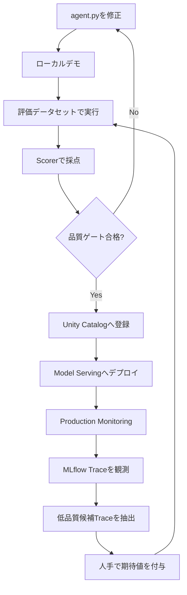
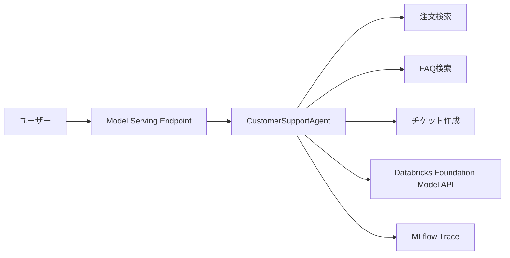
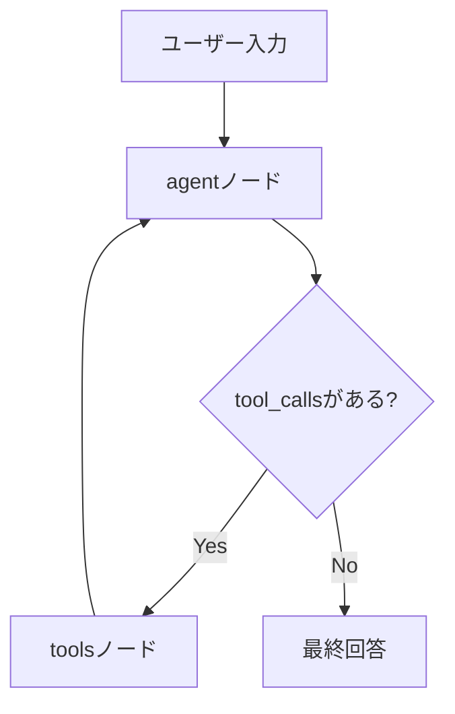
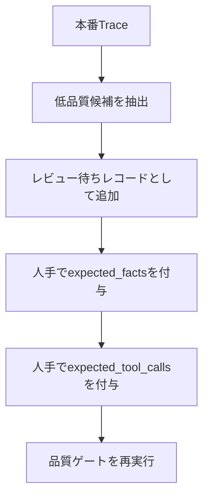
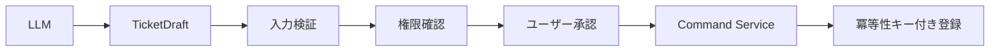

## はじめに

LLMにツールを渡し、問い合わせ内容に応じてAPIや検索処理を呼び分けるだけであれば、AIエージェントは比較的短いコードで構築できます。

しかし、業務システムとして運用する段階では、「回答できたか」だけでは不十分です。

カスタマーサポートAIが注文状況を回答した場合、少なくとも次を確認できる必要があります。

- 注文検索ツールを本当に呼び出したか
- 正しい注文番号を引数に渡したか
- 回答中の日付や商品名がツール結果に含まれていたか
- 不要なチケット作成を実行していないか
- プロンプト変更によって品質が低下していないか
- 本番で見つかった問題を次の評価へ戻せるか

このように、AIエージェントの開発、評価、観測、デプロイ、監視、改善を一つの循環として管理する考え方が **AgentOps** です。

本記事では、Databricks、MLflow 3、LangGraphを使い、次のループを実装するための設計とコード例を示します。



:::message alert
**2026年7月現在の推奨経路について**

本記事は、MLflow `ResponsesAgent`をUnity Catalogへ登録し、Databricks Model Servingへデプロイする方式を扱います。

2026年7月現在、新規エージェント開発ではDatabricks AppsベースのCustom Agentが推奨されています。本記事の構成は、AgentOpsの主要要素をNotebookで理解する教材、既存のModel Serving環境、またはAppsを利用できない環境向けとして読んでください。
:::

https://docs.databricks.com/aws/en/agents/agent-framework/migrate-agent-to-apps

## サンプルNotebook

記事で使用するベースNotebookはGitHubで公開しています。

https://github.com/aymkbyshi/databricks-agentops-customer-support

公開Notebookでは、次を上から順に実行できます。

- LangGraphと`ResponsesAgent`によるエージェント構築
- 専用一時ファイルと`importlib`による明示的な読み込み
- ローカルデモとMLflow Tracing
- Unity Catalogへのモデル登録
- Model Servingへのデプロイ
- Endpoint更新完了待ちとREADY確認
- デプロイ済みEndpointへの問い合わせ
- Trace一覧の確認

評価データセット、品質ゲート、Production Monitoring、改善ループは、本記事のコード例を基に利用環境へ追加してください。MLflowの評価・監視APIは更新が続いているため、利用バージョンの公式ドキュメントも確認してください。

## 今回扱う範囲

| フェーズ | 実装内容 | 主な機能 |
| --- | --- | --- |
| 開発 | LangGraphでツール実行型エージェントを構築 | LangGraph、ResponsesAgent |
| 観測 | LLM、ツール、入出力、レイテンシーを記録 | MLflow Tracing |
| 評価 | 入力と期待値を使って採点 | MLflow GenAI Evaluation |
| 品質ゲート | 閾値未達時に後続処理を停止 | Scorer、Python例外 |
| 登録 | コードと依存関係を保存 | MLflow Model、Unity Catalog |
| デプロイ | REST APIとして公開 | Databricks Model Serving |
| 監視 | 本番Traceを継続的に採点 | Production Monitoring |
| 改善 | 低品質候補を評価データへ戻す | Trace検索、Evaluation Dataset |

一方で、本番向けには追加実装が必要です。

- ユーザー認証と注文所有権の検証
- 更新系ツールに対する人手承認
- PIIマスキングとTrace保存ポリシー
- ツール単位のタイムアウト、再試行、Circuit Breaker
- 間接プロンプトインジェクション対策
- CI/CDからの自動評価とデプロイ制御

## 今回作るカスタマーサポートAI

エージェントには3つのツールを与えます。

| ツール | 種別 | 役割 |
| --- | --- | --- |
| `lookup_order_status` | 読み取り | 注文番号から配送状況を取得 |
| `search_faq` | 読み取り | 返品、配送、支払い、保証などのFAQを検索 |
| `create_support_ticket` | 更新 | 問い合わせチケットを作成するモック |



注文、FAQ、チケットはPython上のモックデータとして実装します。本番ではエージェント全体を書き換えるのではなく、各ツールの内部だけを既存API、Aurora、検索基盤などへ差し替える想定です。

## 1. 実行環境を準備する

```python
%pip install -U \
    mlflow==3.6.0 \
    databricks-langchain==0.8.2 \
    langgraph==0.3.4 \
    langchain-core==0.3.86 \
    databricks-agents \
    pydantic==2.12.5 \
    -q

dbutils.library.restartPython()
```

主要な直接依存を固定する目的は、Notebook再実行時のAPI差分を抑え、開発環境とServing環境の差を小さくすることです。

:::message
この指定は完全なlockfileではありません。実運用では、Databricks Runtime、Pythonバージョン、クラウド、リージョン、ServerlessまたはClassic、実行確認日、間接依存も記録してください。
:::

## 2. モデル、評価データ、Experimentを設定する

```python
CATALOG = "main"
SCHEMA = "your_schema"

MODEL_NAME = f"{CATALOG}.{SCHEMA}.customer_support_agent"
EVAL_DATASET_NAME = f"{CATALOG}.{SCHEMA}.customer_support_eval"

AGENT_ENDPOINT_NAME = "customer-support-agent"
LLM_ENDPOINT = "databricks-meta-llama-3-3-70b-instruct"
AGENT_FILE_PATH = "/tmp/customer_support_agent.py"
```

`/tmp/agent.py`のような汎用名を使うと、同じ計算環境上の別Notebookや再実行時の残骸と衝突しやすくなります。専用名を使うことで、どのファイルを読み込み、どのファイルをモデル登録したかが明確になります。

MLflow Experimentも明示します。

```python
import mlflow

try:
    username = (
        dbutils.notebook.entry_point
        .getDbutils()
        .notebook()
        .getContext()
        .userName()
        .get()
    )
except Exception:
    username = "your-email@databricks.com"

MLFLOW_EXPERIMENT_NAME = f"/Users/{username}/customer-support-agent"
mlflow.set_experiment(MLFLOW_EXPERIMENT_NAME)
```

同じExperimentへ、ローカルデモ、評価Run、モデル登録Run、本番Trace、MonitoringのFeedbackを集約します。

## 3. 一時ファイルの衝突を避ける

```python
import os

try:
    os.chmod(AGENT_FILE_PATH, 0o666)
except FileNotFoundError:
    pass
except PermissionError:
    os.remove(AGENT_FILE_PATH)
```

これはNotebook環境で再実行しやすくするための処理です。本番アプリでは、アプリケーションコードを共有`/tmp`へ動的生成する構成より、Gitとビルド成果物で管理する方が適切です。

## 4. `ResponsesAgent`とLangGraphでエージェントを作る

Notebook内で自己完結したPythonファイルを書き出します。

```python
%%writefile /tmp/customer_support_agent.py
```

処理フローは次のとおりです。



`agent`ノードはLLMを呼び出し、ツール呼び出しが返れば`tools`ノードへ遷移します。ツール結果は再びLLMへ渡され、最終回答が生成されるまでループします。

```python
class CustomerSupportAgent(ResponsesAgent):
    def __init__(self):
        self.tools = [
            lookup_order_status,
            search_faq,
            create_support_ticket,
        ]
        self.llm = ChatDatabricks(
            endpoint=LLM_ENDPOINT,
            temperature=0.1,
            max_tokens=2000,
        )
        self.llm_with_tools = self.llm.bind_tools(self.tools)
        self.graph = self._build_graph()
```

### プロンプトで出力形式を安定させる

ツール結果を回答へ正確に反映させるため、次のルールを追加します。

- 注文状態、日付、商品名、チケットIDを変換・省略しない
- 日付は`YYYY-MM-DD`のまま記載する
- ツール結果に基づく回答は「システムで確認しました。結果：」と前置する
- 挨拶や雑談ではツールを呼ばない
- 返品・交換で注文番号がある場合は、注文確認後に返品FAQも検索する

ただし、プロンプトはセキュリティ境界ではありません。「必ず実行する」「実行しない」と書いても、認可や承認の代わりにはなりません。

### ツールループに上限を設ける

```python
for event in self.graph.stream(
    {"messages": messages},
    stream_mode=["updates"],
    config={"recursion_limit": 10},
):
    ...
```

`recursion_limit`は無限ループを防ぐ最低限のフェイルセーフです。本番では、LLM呼び出し、ツール、リクエスト全体のタイムアウト、最大ツール回数、レート制限、費用上限、Circuit Breakerも必要です。

## 5. `importlib`で対象ファイルを明示的に読み込む

```python
import importlib.util
import os

if not os.path.exists(AGENT_FILE_PATH):
    raise FileNotFoundError(f"{AGENT_FILE_PATH} が見つかりません。")

spec = importlib.util.spec_from_file_location(
    "customer_support_agent_module",
    AGENT_FILE_PATH,
)
if spec is None or spec.loader is None:
    raise ImportError(f"{AGENT_FILE_PATH} の読み込み準備に失敗しました。")

agent_module = importlib.util.module_from_spec(spec)
spec.loader.exec_module(agent_module)
AGENT = agent_module.AGENT
```

この方法には次の利点があります。

- 読み込むファイルが明確
- 同名モジュールのキャッシュ衝突を避けやすい
- `sys.path`をグローバルに変更しない
- ファイルがない場合に早い段階で失敗できる

## 6. ローカル実行は「テスト」ではなくデモ

```python
demo_agent("注文ORD-001の配送状況を教えてください")
demo_agent("返品ポリシーを教えてください")
demo_agent(
    "注文商品に問題があります。"
    "TEST-USER-001として問い合わせチケットの登録をお願いします"
)
```

`demo_agent()`は回答を表示するだけです。期待したツール、引数、回数、禁止アクション、回答中の事実を検証していないため、自動テストではありません。

自動検証は次の品質ゲートで行います。

## 7. 評価データセットを用意する

評価レコードには、入力だけでなく期待値を持たせます。

```yaml
inputs:
  input:
    - role: user
      content: 注文ORD-001の配送状況を教えてください
expectations:
  expected_facts:
    - ノートPC
    - 配送中
    - 2026-07-20
  expected_tool_calls:
    - name: lookup_order_status
      args:
        order_id: ORD-001
      max_calls: 1
```

`expected_facts`は最終回答の事実を、`expected_tool_calls`は期待する実行経路を表します。

複数ツールが必要なケースもラベル化できます。たとえば、注文番号付きの返品問い合わせでは、注文検索とFAQ検索の両方を期待値へ含めます。

## 8. Scorerでデプロイ前評価を行う

| Scorer | 確認内容 | 参照先 |
| --- | --- | --- |
| `expected_facts_present` | 期待事実が回答に含まれるか | 最終回答 |
| `japanese_response` | 日本語で回答しているか | 最終回答 |
| `no_unverified_claims` | 未確認情報を断定していないか | 最終回答 |
| `tool_call_accuracy` | 期待したツールと引数を使ったか | Trace |
| `tool_groundedness` | 回答の期待事実がツール結果にも存在するか | Trace内のツール出力 |

### 最終回答だけを見る評価

```python
@scorer
def expected_facts_present(inputs, outputs, expectations):
    facts = (expectations or {}).get("expected_facts", [])
    if not facts:
        return True
    return all(fact in str(outputs) for fact in facts)
```

このScorerは、商品名、状態、日付の欠落を決定的に検出するスモークテストです。ただし、否定文や表記揺れまでは判定できません。

`no_unverified_claims`はLLM Judgeです。

```python
Guidelines(
    name="no_unverified_claims",
    guidelines=[
        "ツールやユーザー入力で確認していない情報を断定しないこと",
        "不明な場合は不明と述べること",
    ],
)
```

このJudgeは最終回答だけを見るため、ツールで確認済みの事実を「未検証の断定」と誤判定する場合があります。後述する品質ゲートでは参考指標として扱います。

### Traceを使う評価

`tool_call_accuracy`は、期待したツール名、引数、最大呼び出し回数と、Trace上の実際のツール呼び出しを比較します。

```python
@scorer
def tool_call_accuracy(inputs, outputs, expectations, trace):
    expected = (expectations or {}).get("expected_tool_calls", [])
    actual_calls = _extract_tool_calls(trace)
    ...
```

これにより、次の失敗を検出できます。

- 注文問い合わせなのに注文検索を呼ばなかった
- `ORD-001`ではなく別のIDを渡した
- 不要なツールを繰り返し呼んだ
- 複数ツールが必要な問い合わせで片方しか呼ばなかった

`tool_groundedness`は、Trace全体ではなく、ツールSpanの出力だけを検査します。

```python
@scorer
def tool_groundedness(inputs, outputs, expectations, trace):
    facts = (expectations or {}).get("expected_facts", [])
    output_text = str(outputs)
    tool_output_text = "\n".join(_extract_tool_outputs(trace))

    claimed_facts = [fact for fact in facts if fact in output_text]
    if not claimed_facts:
        return False

    return all(fact in tool_output_text for fact in claimed_facts)
```

ユーザー入力、システムプロンプト、期待値、LLM出力まで含むTrace全体を文字列検索すると、ツール結果に存在しない事実でも合格する可能性があります。Span typeや属性を使い、対象をツール出力へ限定することが重要です。

ここで検証しているのはモデル内部の思考ではありません。

> どの入力、ツール、引数、ツール結果を経由して回答へ到達したか

という実行経路とデータの来歴です。

## 9. Blocking指標と参考指標を分ける

すべてのScorerを同じ精度の測定器として扱うのは適切ではありません。

```python
BLOCKING_QUALITY_THRESHOLDS = {
    "expected_facts_present/mean": 0.60,
    "japanese_response/mean": 1.00,
    "tool_groundedness/mean": 0.70,
    "tool_call_accuracy/mean": 0.80,
}

REFERENCE_METRICS = {
    "no_unverified_claims/mean",
}
```

重要なのは、閾値の数字だけではなく、なぜBlockingにするのか、なぜ参考指標にするのかを説明できることです。

- `japanese_response`は明確な要件なので100%
- `tool_call_accuracy`はTraceベースで比較的決定的なので高め
- `tool_groundedness`はTrace構造の抽出揺れもあるため少し許容
- `expected_facts_present`は表現やケース難易度の差を考慮
- `no_unverified_claims`は出力だけを見るJudgeで誤判定があるため参考指標

:::message alert
ここに示す閾値はサンプルです。本番投入前に、評価件数、ケース構成、重大度、ラベル品質、Scorerの誤判定率を確認して調整してください。
:::

平均値だけでは、重大な1件を見逃す可能性があります。認可違反、不正な更新処理、他ユーザーのデータ返却などは、平均値ではなく許容件数ゼロで管理します。

## 10. 品質ゲートでデプロイを止める

```python
failing = {}

for metric, threshold in BLOCKING_QUALITY_THRESHOLDS.items():
    actual = gate_results.metrics.get(metric, 0.0)
    if actual < threshold:
        failing[metric] = (actual, threshold)

if failing:
    details = ", ".join(
        f"{metric}: actual={actual:.3f}, threshold={threshold:.3f}"
        for metric, (actual, threshold) in failing.items()
    )
    raise RuntimeError(
        "品質ゲート不合格。"
        f" {details}。agent.pyを修正して再実行してください。"
    )
```

評価結果を表示するだけではAgentOpsのゲートにはなりません。例外を発生させ、後続のモデル登録とデプロイを実際に停止することが重要です。

重大ケースは平均値とは別に判定します。

```python
critical_failures = gate_results.tables["eval_results"].query(
    "severity == 'critical' and passed == False"
)

if not critical_failures.empty:
    raise RuntimeError(
        f"重大ケースが{len(critical_failures)}件失敗したためデプロイを停止します。"
    )
```

実際の評価結果テーブルの列名は、利用しているMLflowバージョンと評価処理に合わせて変更してください。

## 11. Unity Catalogへモデルを登録する

```python
with mlflow.start_run(run_name="customer-support-agent"):
    model_info = mlflow.pyfunc.log_model(
        name="agent",
        python_model=AGENT_FILE_PATH,
        resources=resources,
        pip_requirements=[
            "mlflow==3.6.0",
            "databricks-langchain==0.8.2",
            "langgraph==0.3.4",
            "langchain-core==0.3.86",
            "pydantic==2.12.5",
        ],
        input_example=input_example,
        registered_model_name=MODEL_NAME,
    )
```

`python_model`へ、デモで読み込んだものと同じ`AGENT_FILE_PATH`を渡します。これにより、ローカル確認したコードと登録するコードの取り違えを避けやすくなります。

## 12. 既存Endpointの更新完了を待ってからデプロイする

同じEndpointへ短時間に連続デプロイすると、前回の設定更新が終わっておらず失敗することがあります。

```python
def wait_for_config_update(name: str, timeout_min: int = 20):
    deadline = time.time() + timeout_min * 60

    while time.time() < deadline:
        try:
            endpoint = w.serving_endpoints.get(name=name)
        except NotFound:
            return

        config_update = endpoint.state.config_update.value
        if config_update in ("NOT_UPDATING", "UPDATE_CANCELED"):
            return
        if config_update == "UPDATE_FAILED":
            raise RuntimeError("Endpointの前回更新が失敗しています")

        time.sleep(30)

    raise TimeoutError("Endpointの設定更新が完了しませんでした")
```

その後、登録済みモデルのバージョンを明示してデプロイします。

```python
deploy_info = agents.deploy(
    model_name=MODEL_NAME,
    model_version=model_info.registered_model_version,
    endpoint_name=AGENT_ENDPOINT_NAME,
)
```

## 13. READYになるまで待機し、失敗時は停止する

```python
def wait_for_endpoint(name: str, timeout_min: int = 20):
    deadline = time.time() + timeout_min * 60

    while time.time() < deadline:
        endpoint = w.serving_endpoints.get(name=name)
        ready = endpoint.state.ready.value
        config_update = endpoint.state.config_update.value

        if ready == "READY":
            return
        if config_update == "UPDATE_FAILED":
            raise RuntimeError(f"Endpoint {name} の更新に失敗しました")

        time.sleep(30)

    raise TimeoutError(
        f"Endpointが{timeout_min}分以内にREADYになりませんでした"
    )
```

`False`を返すだけでは、Notebookの次セルを実行して未準備のEndpointへ問い合わせる可能性があります。例外で停止する方が安全です。

## 14. Production Monitoringを設定する

:::message alert
**2026年7月現在、MLflow 3 Production MonitoringはBetaです。**

利用にはワークスペースのPreview設定、Serverless budget policy、SQL Warehouseなどの前提条件が必要になる場合があります。最新の要件を公式ドキュメントで確認してください。
:::

https://docs.databricks.com/aws/en/mlflow3/genai/eval-monitor/production-monitoring

本番ですべてのScorerを100%のリクエストへ適用すると、コストと処理量が増えます。このサンプルでは、軽い要件を高い割合で、LLM Judgeを低い割合でサンプリングします。

| Scorer | サンプリング率 | 目的 |
| --- | ---: | --- |
| `prod_japanese_response` | 100% | 日本語回答という基本契約を確認 |
| `prod_no_unverified_claims` | 50% | 未確認情報の断定を傾向監視 |

```python
registered = scorer.register(name=scorer_name)
registered.start(
    sampling_config=ScorerSamplingConfig(
        sample_rate=sample_rate
    )
)
```

TraceベースのScorerは情報量が多い一方、処理コストも高くなります。最初は軽量な出力ベース指標で傾向を掴み、重要ケースや異常検知時にTraceベース評価を追加する構成が現実的です。

## 15. デプロイ済みEndpointへ問い合わせる

```python
chat("注文ORD-001の配送状況を教えてください")
chat("返品ポリシーを教えてください")
chat(
    "注文商品に問題があります。"
    "TEST-USER-001として問い合わせチケットの登録をお願いします"
)
```

実名ではなく合成IDを使用します。ただし、合成IDへ変えるだけではPII対策は完成しません。本番ではTrace送信前のマスキング、閲覧権限、保存期間、削除ポリシーが必要です。

## 16. MLflow Traceで実行経路を確認する

MLflowのTraces画面では、リクエスト、レスポンス、実行時間、トークン数、状態を一覧で確認できます。詳細画面のSpanツリーからは、注文検索ツール、引数、戻り値、最終回答の順序を追えます。

Traceから確認できるのは次です。

- 入力
- 選択されたツール
- ツール引数
- ツールの戻り値
- 最終回答
- Spanごとのレイテンシー
- エラー

複雑なPythonオブジェクトを含むDataFrameを表示する前に、object型列を文字列へ変換します。

```python
object_columns = list(traces.select_dtypes(include="object").columns)
if object_columns:
    traces = traces.astype({column: str for column in object_columns})

display(traces)
```

## 17. 低品質候補Traceを評価データへ戻す

改善ループでは、本番Traceを自動的に「正解データ」にしません。



最小実装では、回答が極端に短いTraceを候補として抽出できます。

```python
is_low_quality_candidate = len(answer.strip()) < 5
```

本番では次も条件へ加えます。

- TraceのstatusがERROR
- Monitoring Scorerが不合格
- レイテンシー超過
- ユーザーの低評価
- チケット作成など副作用ツールの異常実行
- 同じツールの過剰な再呼び出し

候補レコードには空の期待値と、人手レビューが必要であることを示すメモを付けます。

```python
{
    "inputs": {"input": input_messages},
    "expectations": {
        "expected_facts": [],
        "expected_tool_calls": [],
        "note": (
            "AUTO: 低品質候補Traceから生成。"
            "期待値を人手で入力すること"
        ),
    },
}
```

自動抽出は候補発見まで、人間は正解定義を担当するという分担です。

## 18. セキュリティ上の重要な補足

### 注文番号だけで検索しない

サンプルの`lookup_order_status`は注文番号だけでデータを返します。本番では、認証済み顧客IDをサーバー側から注入し、注文の所有権を検証してください。

```text
認証済み顧客ID
  +
注文番号
  ↓
所有権検証
  ↓
注文情報を返す
```

LLMに顧客IDを生成させてはいけません。

### 更新系ツールをLLMへ直結しない

`create_support_ticket`は副作用を持つ処理です。本番では次のように分離します。



プロンプトの指示は、本番の認可や承認を代替しません。

### 間接プロンプトインジェクション

FAQや外部APIの戻り値は、信頼できる命令ではなくデータとして扱います。

- 返却フィールドをallowlist化する
- HTML、Markdown、スクリプトを除去する
- 外部データによって権限を増やさない
- 更新系ツールを別のポリシー層で制御する

### PIIとTrace

`mlflow.langchain.autolog()`を有効化すると、入力、ツール引数、戻り値がTraceへ記録される可能性があります。

本番では、Trace送信前のマスキング、最小限の記録、閲覧権限、保存期間、削除手順を設計してください。

## まとめ

本記事では、カスタマーサポートAIを題材に、次のAgentOpsループを説明しました。

- LangGraphとResponsesAgentによるエージェント開発
- 専用ファイルパスと`importlib`による確実なコード読み込み
- MLflow Traceによる実行経路の観測
- 評価データセットとScorer
- Blocking指標と参考指標の分離
- 重大ケースをゼロ許容で扱う品質ゲート
- 品質ゲートによるデプロイ停止
- Unity Catalogへのモデル登録
- Endpoint更新完了待ちとREADY確認
- Production Monitoringによる継続採点
- 低品質候補Traceを人手レビューへ戻す改善ループ

AgentOpsで重要なのは、画面でTraceを眺めることだけではありません。

> 実行を観測し、期待値と比較し、基準未達なら止め、本番の問題を次の評価へ戻す

という循環を、実際のコードパスへ接続することです。

新規の本番システムでは、Databricks Apps、AgentServer、Declarative Automation Bundles、Git、CI/CD、`uv.lock`を使う構成も検討してください。

## サンプルコード

ベースNotebookはこちらです。

https://github.com/aymkbyshi/databricks-agentops-customer-support
