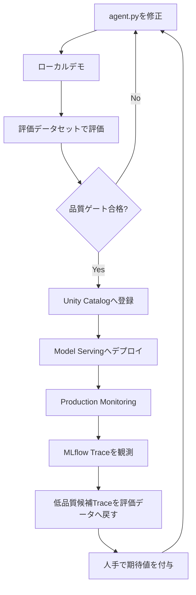
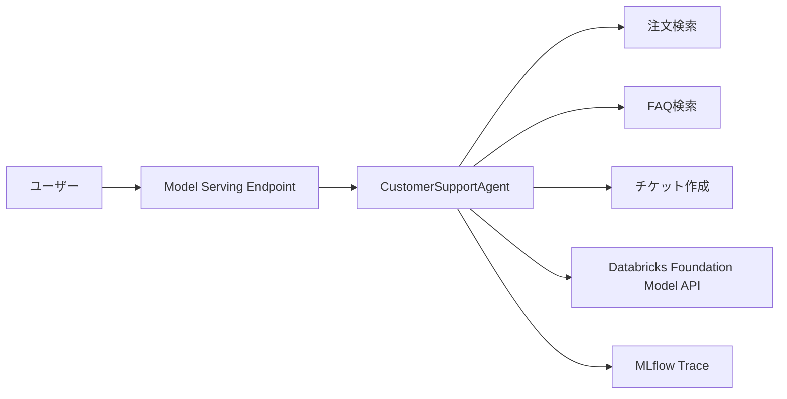
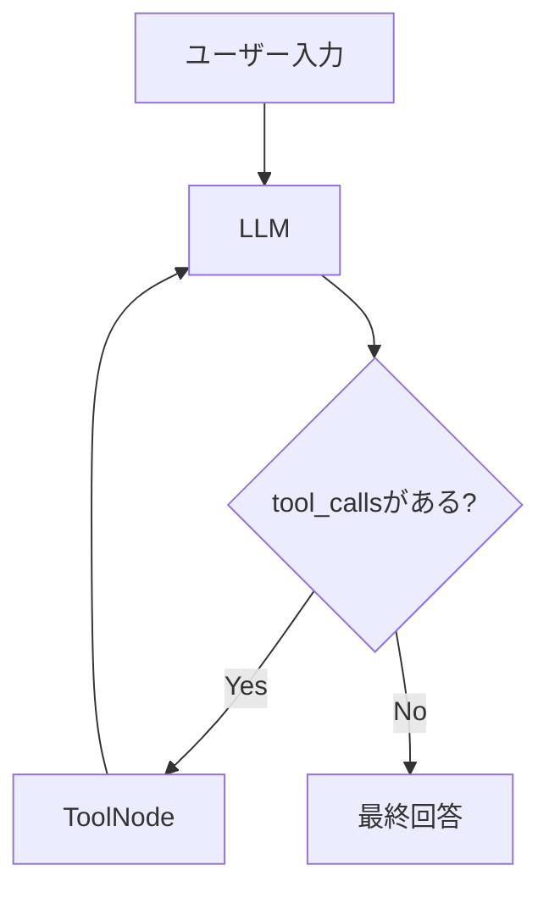
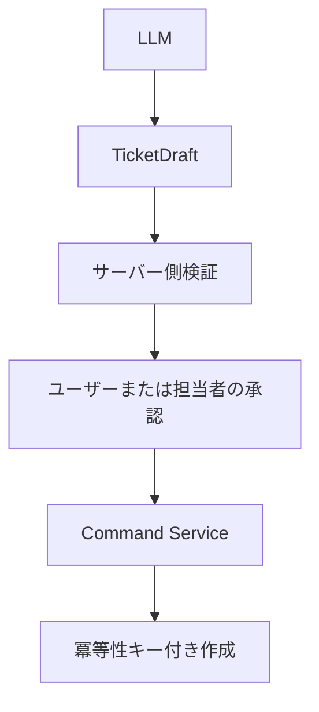

## はじめに

AIエージェントは、LLMにツールを渡せば比較的短いコードで作れます。

しかし、実運用では「回答が返った」だけでは足りません。

- 期待したツールを選択したか
- ツールへ正しい引数を渡したか
- 回答中の事実がツール結果に含まれていたか
- デプロイ前の品質基準を満たしたか
- 本番で品質が低下していないか
- 問題のある実行を次の評価データへ戻せるか

本記事では、カスタマーサポートAIを題材に、DatabricksとMLflowを使って次のループを実装します。



:::message alert
2026年7月現在、Databricksは新規エージェント開発にDatabricks AppsベースのCustom Agentを推奨しています。本記事は、ResponsesAgentをUnity Catalogへ登録し、Model Servingへデプロイする従来方式を扱います。学習目的、既存環境、Appsを利用できない環境向けの構成として読んでください。
:::

## サンプルNotebook

この記事で使用するNotebookはGitHubで公開しています。

https://github.com/aymkbyshi/databricks-agentops-customer-support

Notebookには、記事で省略しているTrace解析用ヘルパーも含めています。

## 今回作るもの

エージェントには3つのツールを用意します。

| ツール | 役割 |
| --- | --- |
| `lookup_order_status` | 注文番号から配送状況を確認 |
| `search_faq` | 返品、配送、支払い、保証などを検索 |
| `create_support_ticket` | 問い合わせチケットを作成するモック |



注文、FAQ、チケットはPython上のモックです。本番ではツール内部を既存APIやAuroraなどへ差し替えます。

## 1. 実行環境を準備する

```python
%pip install -U \
    mlflow==3.6.0 \
    databricks-langchain==0.8.2 \
    langgraph==0.3.4 \
    langchain-core==0.3.86 \
    databricks-agents \
    pydantic==2.12.5 \
    -q

dbutils.library.restartPython()
```

:::message
これは完全なlockfileではありません。再現性を重視する場合は、Databricks Runtime、Python、クラウド、リージョン、実行確認日も記録し、新規のDatabricks Apps構成では`pyproject.toml`と`uv.lock`を利用します。
:::

## 2. 登録先と評価データセットを設定する

```python
CATALOG = "main"
SCHEMA = "your_schema"
MODEL_NAME = f"{CATALOG}.{SCHEMA}.customer_support_agent"
EVAL_DATASET_NAME = f"{CATALOG}.{SCHEMA}.customer_support_eval"
AGENT_ENDPOINT_NAME = "customer-support-agent"
LLM_ENDPOINT = "databricks-meta-llama-3-3-70b-instruct"
```

ローカル実行、評価、モデル登録、本番Traceを同じExperimentへ集約します。

```python
MLFLOW_EXPERIMENT_NAME = f"/Users/{username}/customer-support-agent"
mlflow.set_experiment(MLFLOW_EXPERIMENT_NAME)
```

## 3. ResponsesAgentとLangGraphでエージェントを作る

Notebook内で`/tmp/agent.py`を書き出します。

```python
%%writefile /tmp/agent.py
```

処理フローはシンプルです。



グラフはリクエストごとに再構築せず、初期化時に一度だけ作ります。

```python
class CustomerSupportAgent(ResponsesAgent):
    def __init__(self):
        self.tools = [lookup_order_status, search_faq, create_support_ticket]
        self.llm = ChatDatabricks(
            endpoint=LLM_ENDPOINT,
            temperature=0.1,
            max_tokens=2000,
        )
        self.llm_with_tools = self.llm.bind_tools(self.tools)
        self.graph = self._build_graph()
```

ツールループには上限を設定します。

```python
for event in self.graph.stream(
    {"messages": messages},
    stream_mode=["updates"],
    config={"recursion_limit": 10},
):
    ...
```

`recursion_limit`だけで運用上の安全性が完成するわけではありません。本番では、LLM・ツール・リクエスト全体のタイムアウト、最大ツール回数、レート制限、費用上限、Circuit Breakerも必要です。

## 4. ローカル実行はデモとして扱う

```python
demo_agent("注文ORD-001の配送状況を教えてください")
demo_agent("返品ポリシーを教えてください")
demo_agent(
    "商品に不具合があります。"
    "TEST-USER-001としてサポートチケットの作成をお願いします"
)
```

:::message alert
`demo_agent()`は回答を表示するだけで、自動テストではありません。期待したツール、引数、呼び出し回数、禁止アクション、回答の事実集合は、次の品質ゲートで検証します。
:::

## 5. 評価データセットを用意する

評価レコードには、入力と期待値を持たせます。

```yaml
inputs:
  input:
    - role: user
      content: 注文ORD-001の配送状況を教えてください
expectations:
  expected_facts:
    - ノートPC
    - 配送中
    - 2026-07-20
  expected_tool_calls:
    - name: lookup_order_status
      args:
        order_id: ORD-001
      max_calls: 1
```

`expected_facts`だけでなく、期待するツール名、引数、最大呼び出し回数もラベルに含めます。

## 6. 5つのScorerでデプロイ前評価を行う

| Scorer | 確認する内容 | 参照先 |
| --- | --- | --- |
| `expected_facts_present` | 期待する事実が回答に含まれるか | 最終回答 |
| `japanese_response` | 日本語で回答しているか | 最終回答 |
| `no_unverified_claims` | 未確認情報を断定していないか | 最終回答 |
| `tool_call_accuracy` | 期待したツールと引数を使ったか | Trace |
| `tool_groundedness` | 回答中の事実がツール結果にも存在するか | Trace |

### 出力だけを見る評価

```python
@scorer
def expected_facts_present(inputs, outputs, expectations):
    facts = (expectations or {}).get("expected_facts", [])
    if not facts:
        return True
    return all(fact in str(outputs) for fact in facts)
```

```python
Guidelines(
    name="no_unverified_claims",
    guidelines=[
        "ツールやユーザー入力で確認していない情報を断定しないこと",
        "不明な場合は不明と述べること",
    ],
)
```

### Traceを使う評価

`tool_call_accuracy`は、評価データの`expected_tool_calls`と、Trace上の実際のツール呼び出しを比較します。

```python
@scorer
def tool_call_accuracy(inputs, outputs, expectations, trace):
    expected = (expectations or {}).get("expected_tool_calls", [])
    actual_calls = _extract_tool_calls(trace)
    ...
```

`tool_groundedness`は、最終回答に現れた期待事実がTrace内のツール結果にも現れるかを確認します。

```python
@scorer
def tool_groundedness(inputs, outputs, expectations, trace):
    facts = (expectations or {}).get("expected_facts", [])
    output_text = str(outputs)
    trace_text = json.dumps(
        _coerce_to_dict(trace),
        ensure_ascii=False,
        default=str,
    )
    claimed_facts = [fact for fact in facts if fact in output_text]
    return bool(claimed_facts) and all(
        fact in trace_text for fact in claimed_facts
    )
```

ここで検証しているのは、モデル内部の思考理由ではありません。**どの入力、ツール、引数、ツール結果を経由して回答へ到達したか**という実行経路とデータ来歴です。

```python
gate_results = mlflow.genai.evaluate(
    data=dataset,
    predict_fn=_predict_fn,
    scorers=[
        expected_facts_present,
        tool_call_accuracy,
        tool_groundedness,
        Guidelines(
            name="japanese_response",
            guidelines=["回答が必ず日本語で書かれていること"],
        ),
        Guidelines(
            name="no_unverified_claims",
            guidelines=[
                "ツールやユーザー入力で確認していない情報を断定しないこと",
                "不明な場合は不明と述べること",
            ],
        ),
    ],
)
```

## 7. 品質ゲートでデプロイを止める

デモでは、11件の評価データに対して全項目100%を要求します。

```python
QUALITY_THRESHOLDS = {
    "expected_facts_present/mean": 1.00,
    "japanese_response/mean": 1.00,
    "no_unverified_claims/mean": 1.00,
    "tool_groundedness/mean": 1.00,
    "tool_call_accuracy/mean": 1.00,
}
```

未達項目があれば例外を発生させます。

```python
if failing:
    raise RuntimeError(
        "品質ゲート不合格。"
        "agent.pyを修正してStep 3から再実行してください。"
    )
```

:::message
100%という閾値は、小規模なデモデータで挙動を明確にするための値です。本番では、データ件数、ラベル品質、重大度、信頼区間、Scorerの誤判定を考慮して決めます。情報漏洩や未承認の更新処理は平均値ではなく、許容件数ゼロで管理します。
:::

## 8. Unity Catalogへ登録してModel Servingへデプロイする

評価に合格したコードだけを登録します。

```python
with mlflow.start_run(run_name="customer-support-agent"):
    model_info = mlflow.pyfunc.log_model(
        name="agent",
        python_model="/tmp/agent.py",
        resources=resources,
        pip_requirements=[
            "mlflow==3.6.0",
            "databricks-langchain==0.8.2",
            "langgraph==0.3.4",
            "langchain-core==0.3.86",
            "pydantic==2.12.5",
        ],
        input_example=input_example,
        registered_model_name=MODEL_NAME,
    )
```

```python
deploy_info = agents.deploy(
    model_name=MODEL_NAME,
    model_version=model_info.registered_model_version,
    endpoint_name=AGENT_ENDPOINT_NAME,
)
```

Endpointは`READY`になるまで待ち、タイムアウト時は例外で停止します。

## 9. Production Monitoringで本番Traceを自動採点する

最初のScorerは、`register()`から`start()`までをそのまま記述します。

```python
base_japanese = Guidelines(
    name="prod_japanese_response",
    guidelines=["回答が必ず日本語で書かれていること"],
)

japanese_scorer = base_japanese.register(
    name="prod_japanese_response"
)

japanese_scorer.start(
    sampling_config=ScorerSamplingConfig(sample_rate=1.0)
)
```

未確認情報の断定は、コストを抑えるため50%で評価します。

```python
_start_monitoring_scorer(
    Guidelines(
        name="prod_no_unverified_claims",
        guidelines=[
            "ツールやユーザー入力で確認していない情報を断定しないこと",
            "不明な場合は不明と述べること",
        ],
    ),
    scorer_name="prod_no_unverified_claims",
    sample_rate=0.5,
)
```

開発時の品質ゲートではTraceベースのScorerも実行しますが、継続監視ではコストと処理量を考慮し、まず軽量な出力ベースのJudgeから始めています。

:::message alert
Production Monitoringを使うには、対象Workspaceの機能提供状況、Traceの保存先、権限、必要に応じてSQL Warehouseなどの前提を確認してください。継続監視用Scorerの数にも上限があります。
:::

## 10. MLflow Traceで実行経路を見る


*リクエスト、レスポンス、実行時間、トークン数、状態を一覧で確認する*


*lookup_order_statusが選択され、ORD-001が渡され、ツール結果から回答が生成された実行経路*

Traceから確認できるのは、入力、選択されたツール、引数、ツール結果、最終回答、レイテンシー、エラーです。

Traceは「モデルが内面でなぜそう考えたか」を説明するものではありません。実行経路とデータ来歴を観測するための情報です。

## 11. 低品質候補Traceを評価データへ戻す

今回のNotebookでは、短すぎる回答を低品質候補として扱う最小実装です。

```python
is_low_quality_candidate = len(answer.strip()) < 5
```

候補レコードは、期待値が空のレビュー待ちデータとして追加します。

```python
candidate_records.append({
    "inputs": {"input": input_msgs},
    "expectations": {
        "expected_facts": [],
        "expected_tool_calls": [],
        "note": "AUTO: 低品質候補Trace。期待値を人手で記入すること",
    },
})
```

重要なのは、**自動抽出したTraceをそのまま正解データにしないこと**です。

1. 低品質候補を抽出する
2. 評価データセットへレビュー待ちで追加する
3. 人間が`expected_facts`と`expected_tool_calls`を付ける
4. 品質ゲートを再実行する
5. `agent.py`を修正する

本番では、Monitoring Feedback、エラーステータス、レイテンシー、ユーザーフィードバックなども候補抽出条件に加えます。

## 12. セキュリティ上の注意

### 注文検索には所有権検証が必要

注文番号だけで検索できる設計はIDORの原因になります。顧客IDはLLMの出力ではなく、信頼できるサーバー側コンテキストから注入します。

### 副作用ツールはLLMから分離する

`create_support_ticket`はモックです。本番では、プロンプトの「確認してから実行」を認可境界として扱いません。



### PIIをTraceへそのまま送らない

合成IDはデモ上の対策にすぎません。本番では、Trace送信前のマスキング、記録対象のallowlist、閲覧権限、保存期間、削除手順を設計します。

### ツール結果を命令として扱わない

FAQや外部APIの戻り値に命令文が混入すると、間接プロンプトインジェクションになり得ます。

- 返却フィールドをallowlist化する
- HTMLやスクリプトを除去する
- 外部データを命令ではなくデータとして渡す
- 外部データの内容によって権限を増やさない
- 副作用ツールは別のポリシー層で制御する

### ツールの戻り値は構造化する

```python
class OrderLookupResult(BaseModel):
    found: bool
    order_id: str
    status: Literal["processing", "shipped", "delivered"] | None
    estimated_delivery: date | None
    error_code: Literal[
        "NOT_FOUND",
        "FORBIDDEN",
        "UPSTREAM_ERROR",
    ] | None
```

## 13. 新規本番構築ではDatabricks Appsを検討する

```text
Git repository
├── app.yaml
├── agent_server/
├── src/
├── tests/
├── pyproject.toml
├── uv.lock
└── databricks.yml
```

- Databricks Apps
- AgentServer
- Declarative Automation Bundles
- GitとCI/CD
- `uv.lock`
- カスタム認証・ミドルウェア
- 非同期処理
- 永続チャット履歴

Model Serving版で評価・Tracing・Scorerの考え方を理解した後、Apps構成へ移行するのが自然です。

## まとめ

今回のNotebookでは、次のAgentOpsループを実装しました。

- LangGraphとResponsesAgentによるエージェント実装
- MLflow Traceによる実行経路の観測
- 評価データセットによる期待値管理
- 出力ベースとTraceベースの5つのScorer
- 閾値未達時にデプロイを止める品質ゲート
- Unity Catalogへのモデル登録
- Model Servingへのデプロイ
- Production Monitoringによる継続採点
- 低品質候補Traceの評価データセットへの再投入
- 人手ラベルを介した改善ループ

特に重要なのは、次の2点です。

1. Traceを見るだけで終わらず、ツール選択・引数・根拠性をScorerとして評価すること
2. 本番Traceを自動で正解扱いせず、人手レビューを経て評価データへ戻すこと

これにより、「動くAIエージェント」から「評価し、止め、監視し、改善できるAIエージェント」へ一歩進めます。

## ソースコード

完全なNotebookはGitHubで公開しています。

https://github.com/aymkbyshi/databricks-agentops-customer-support
