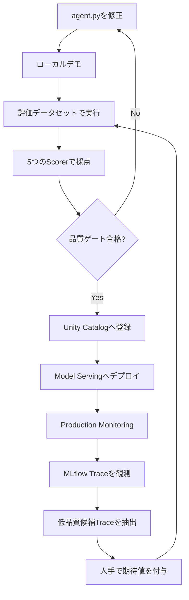
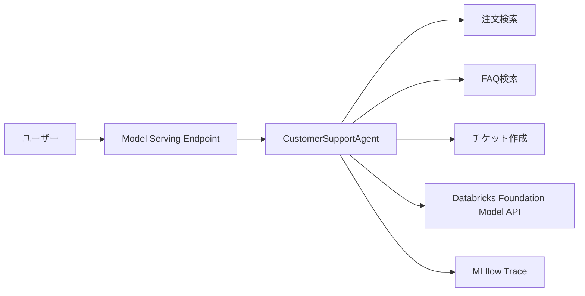
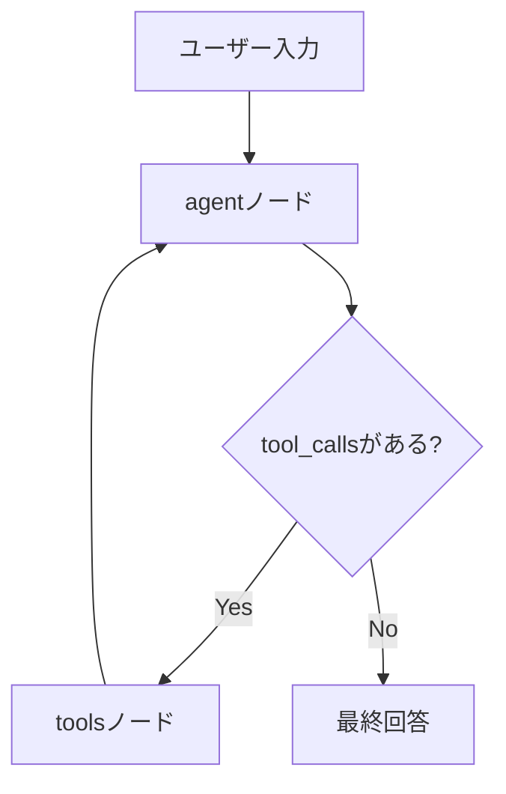
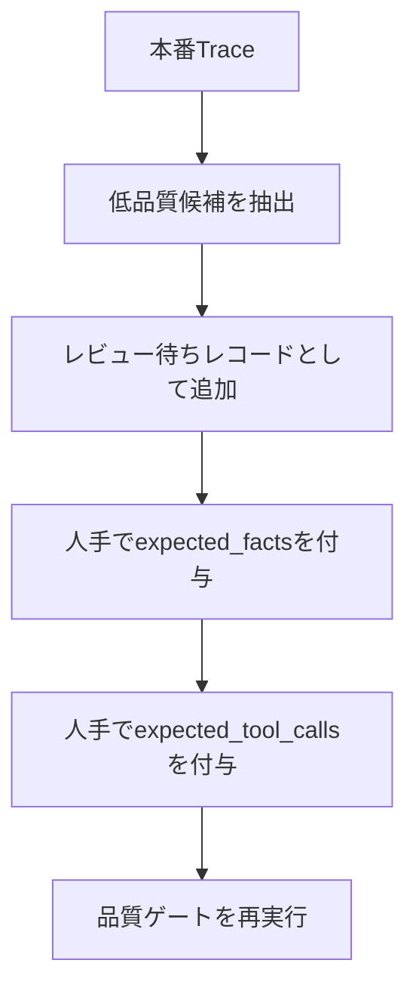
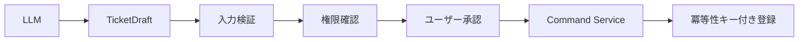

## はじめに

LLMにツールを渡し、問い合わせ内容に応じてAPIや検索処理を呼び分けるだけであれば、AIエージェントは比較的短いコードで構築できます。

しかし、業務システムとして運用する段階では、「回答できたか」だけでは不十分です。

カスタマーサポートAIが注文状況を回答した場合、少なくとも次を確認できる必要があります。

- 注文検索ツールを本当に呼び出したか
- 正しい注文番号を引数に渡したか
- 回答中の日付や商品名がツール結果に含まれていたか
- 不要なチケット作成を実行していないか
- プロンプト変更によって品質が低下していないか
- 本番で見つかった問題を次の評価へ戻せるか

このように、AIエージェントの開発、評価、観測、デプロイ、監視、改善を一つの循環として管理する考え方が **AgentOps** です。

本記事では、Databricks、MLflow 3、LangGraphを使い、次のループを一つのNotebookで実装します。



:::message alert
**2026年7月現在の推奨経路について**

本記事は、MLflow `ResponsesAgent`をUnity Catalogへ登録し、Databricks Model Servingへデプロイする方式を扱います。

2026年7月現在、新規エージェント開発ではDatabricks AppsベースのCustom Agentが推奨されています。本記事の構成は、AgentOpsの主要要素を一つのNotebookで理解する教材、既存のModel Serving環境、またはAppsを利用できない環境向けとして読んでください。
:::

https://docs.databricks.com/aws/en/agents/agent-framework/migrate-agent-to-apps

## サンプルNotebook

記事で使用するNotebookはGitHubで公開しています。

https://github.com/aymkbyshi/databricks-agentops-customer-support

Notebookには、記事では読みやすさのため一部省略しているTrace解析用ヘルパー、品質ゲート、Production Monitoring、改善ループの完全なコードを含めています。

## 今回実装する範囲

| フェーズ | 実装内容 | 主な機能 |
| --- | --- | --- |
| 開発 | LangGraphでツール実行型エージェントを構築 | LangGraph、ResponsesAgent |
| 観測 | LLM、ツール、入出力、レイテンシーを記録 | MLflow Tracing |
| 評価 | 入力と期待値を使って採点 | MLflow GenAI Evaluation |
| 品質ゲート | 閾値未達時に後続処理を停止 | Scorer、Python例外 |
| 登録 | コードと依存関係を保存 | MLflow Model、Unity Catalog |
| デプロイ | REST APIとして公開 | Databricks Model Serving |
| 監視 | 本番Traceを継続的に採点 | Production Monitoring |
| 改善 | 低品質候補を評価データへ戻す | Trace検索、Evaluation Dataset |

一方で、本番向けには追加実装が必要です。

- ユーザー認証と注文所有権の検証
- 更新系ツールに対する人手承認
- PIIマスキングとTrace保存ポリシー
- ツール単位のタイムアウト、再試行、Circuit Breaker
- 間接プロンプトインジェクション対策
- CI/CDからの自動評価とデプロイ制御

## 今回作るカスタマーサポートAI

エージェントには3つのツールを与えます。

| ツール | 種別 | 役割 |
| --- | --- | --- |
| `lookup_order_status` | 読み取り | 注文番号から配送状況を取得 |
| `search_faq` | 読み取り | 返品、配送、支払い、保証などのFAQを検索 |
| `create_support_ticket` | 更新 | 問い合わせチケットを作成するモック |



注文、FAQ、チケットはPython上のモックデータとして実装します。本番ではエージェント全体を書き換えるのではなく、各ツールの内部だけを既存API、Aurora、検索基盤などへ差し替える想定です。

## 1. 実行環境を準備する

```python
%pip install -U \
    mlflow==3.6.0 \
    databricks-langchain==0.8.2 \
    langgraph==0.3.4 \
    langchain-core==0.3.86 \
    databricks-agents \
    pydantic==2.12.5 \
    -q

dbutils.library.restartPython()
```

主要な直接依存を固定する目的は、Notebook再実行時のAPI差分を抑え、開発環境とServing環境の差を小さくすることです。

:::message
この指定は完全なlockfileではありません。実運用では、Databricks Runtime、Pythonバージョン、クラウド、リージョン、ServerlessまたはClassic、実行確認日、間接依存も記録してください。
:::

## 2. モデル、評価データ、Experimentを設定する

```python
CATALOG = "main"
SCHEMA = "your_schema"

MODEL_NAME = f"{CATALOG}.{SCHEMA}.customer_support_agent"
EVAL_DATASET_NAME = f"{CATALOG}.{SCHEMA}.customer_support_eval"

AGENT_ENDPOINT_NAME = "customer-support-agent"
LLM_ENDPOINT = "databricks-meta-llama-3-3-70b-instruct"
AGENT_FILE_PATH = "/tmp/customer_support_agent.py"
```

今回の改善では、エージェントファイルのパスを定数化しました。

以前のように`/tmp/agent.py`という汎用名を使うと、同じ計算環境上の別Notebookや再実行時の残骸と衝突しやすくなります。専用名を使うことで、どのファイルを読み込み、どのファイルをモデル登録したかが明確になります。

```python
print(f"Agent file path: {AGENT_FILE_PATH}")
```

MLflow Experimentも明示します。

```python
try:
    username = (
        dbutils.notebook.entry_point
        .getDbutils()
        .notebook()
        .getContext()
        .userName()
        .get()
    )
except Exception:
    username = "your-email@databricks.com"

MLFLOW_EXPERIMENT_NAME = f"/Users/{username}/customer-support-agent"
mlflow.set_experiment(MLFLOW_EXPERIMENT_NAME)
```

同じExperimentへ次を集約します。

- ローカルデモのTrace
- 品質ゲートの評価Run
- モデル登録Run
- デプロイ後の本番Trace
- Production MonitoringのFeedback

## 3. 一時ファイルの衝突を避ける

Notebookを何度も実行すると、以前作成したファイルが`/tmp`に残ることがあります。所有者やパーミッションが異なる残骸があると、`%%writefile`で上書きできない場合があります。

そこで、書き込み前に専用パスを確認します。

```python
import os

try:
    os.chmod(AGENT_FILE_PATH, 0o666)
except FileNotFoundError:
    pass
except PermissionError:
    os.remove(AGENT_FILE_PATH)
```

これはあくまでNotebook環境で再実行しやすくするための処理です。本番アプリでは、アプリケーションコードを共有`/tmp`へ動的生成する構成より、Gitとビルド成果物で管理する方が適切です。

## 4. `ResponsesAgent`とLangGraphでエージェントを作る

Notebook内で自己完結したPythonファイルを書き出します。

```python
%%writefile /tmp/customer_support_agent.py
```

処理フローは次のとおりです。



`agent`ノードはLLMを呼び出し、ツール呼び出しが返れば`tools`ノードへ遷移します。ツール結果は再びLLMへ渡され、最終回答が生成されるまでループします。

```python
class CustomerSupportAgent(ResponsesAgent):
    def __init__(self):
        self.tools = [
            lookup_order_status,
            search_faq,
            create_support_ticket,
        ]
        self.llm = ChatDatabricks(
            endpoint=LLM_ENDPOINT,
            temperature=0.1,
            max_tokens=2000,
        )
        self.llm_with_tools = self.llm.bind_tools(self.tools)
        self.graph = self._build_graph()
```

### プロンプトで出力形式を安定させる

今回の改善では、ツール結果を回答へ正確に反映させるルールを追加しました。

- 注文状態、日付、商品名、チケットIDを変換・省略しない
- 日付は`YYYY-MM-DD`のまま記載する
- ツール結果に基づく回答は「システムで確認しました。結果：」と前置する
- 挨拶や雑談ではツールを呼ばない
- 返品・交換で注文番号がある場合は、注文確認後に返品FAQも検索する

これは品質ゲートで期待事実とツール呼び出しを検証しやすくするためです。

ただし、プロンプトはセキュリティ境界ではありません。「必ず実行する」「実行しない」と書いても、認可や承認の代わりにはなりません。

### ツールループに上限を設ける

```python
for event in self.graph.stream(
    {"messages": messages},
    stream_mode=["updates"],
    config={"recursion_limit": 10},
):
    ...
```

`recursion_limit`は無限ループを防ぐ最低限のフェイルセーフです。本番では、LLM呼び出し、ツール、リクエスト全体のタイムアウト、最大ツール回数、レート制限、費用上限、Circuit Breakerも必要です。

## 5. `importlib`で対象ファイルを明示的に読み込む

今回の改善では、`sys.path.insert()`と`from agent import AGENT`をやめ、`importlib.util.spec_from_file_location()`でファイルパスから直接読み込みます。

```python
import importlib.util
import os

if not os.path.exists(AGENT_FILE_PATH):
    raise FileNotFoundError(
        f"{AGENT_FILE_PATH} が見つかりません。"
    )

spec = importlib.util.spec_from_file_location(
    "customer_support_agent_module",
    AGENT_FILE_PATH,
)
agent_module = importlib.util.module_from_spec(spec)
spec.loader.exec_module(agent_module)
AGENT = agent_module.AGENT
```

この方法には次の利点があります。

- 読み込むファイルが明確
- 同名モジュールのキャッシュ衝突を避けやすい
- `sys.path`をグローバルに変更しない
- ファイルがない場合に早い段階で失敗できる

## 6. ローカル実行は「テスト」ではなくデモ

```python
demo_agent("注文ORD-001の配送状況を教えてください")
demo_agent("返品ポリシーを教えてください")
demo_agent(
    "注文商品に問題があります。"
    "TEST-USER-001として問い合わせチケットの登録をお願いします"
)
```

`demo_agent()`では、Responses API形式の出力から`message`と`output_text`だけを安全に抽出します。dict形式とオブジェクト形式の両方に対応させています。

:::message alert
`demo_agent()`は自動テストではありません。回答を表示するだけで、期待したツール、引数、回数、禁止アクション、回答中の事実を検証していないためです。
:::

自動検証は次の品質ゲートで行います。

## 7. 評価データセットを用意する

評価レコードには、入力だけでなく期待値を持たせます。

```yaml
inputs:
  input:
    - role: user
      content: 注文ORD-001の配送状況を教えてください
expectations:
  expected_facts:
    - ノートPC
    - 配送中
    - 2026-07-20
  expected_tool_calls:
    - name: lookup_order_status
      args:
        order_id: ORD-001
      max_calls: 1
```

`expected_facts`は最終回答の事実を、`expected_tool_calls`は期待する実行経路を表します。

複数ツールが必要なケースもラベル化できます。たとえば、注文番号付きの返品問い合わせでは、注文検索とFAQ検索の両方を期待値へ含めます。

## 8. 5つのScorerでデプロイ前評価を行う

| Scorer | 確認内容 | 参照先 |
| --- | --- | --- |
| `expected_facts_present` | 期待事実が回答に含まれるか | 最終回答 |
| `japanese_response` | 日本語で回答しているか | 最終回答 |
| `no_unverified_claims` | 未確認情報を断定していないか | 最終回答 |
| `tool_call_accuracy` | 期待したツールと引数を使ったか | Trace |
| `tool_groundedness` | 回答の期待事実がツール結果にも存在するか | Trace |

### 最終回答だけを見る評価

```python
@scorer
def expected_facts_present(inputs, outputs, expectations):
    facts = (expectations or {}).get("expected_facts", [])
    if not facts:
        return True
    return all(fact in str(outputs) for fact in facts)
```

このScorerは単純ですが、商品名、状態、日付の欠落を決定的に検出できます。

`no_unverified_claims`はLLM Judgeです。

```python
Guidelines(
    name="no_unverified_claims",
    guidelines=[
        "ツールやユーザー入力で確認していない情報を断定しないこと",
        "不明な場合は不明と述べること",
    ],
)
```

ただし、このJudgeは最終回答だけを見ます。ツール結果やTraceを参照しないため、実際にはツールで確認済みの事実を「未検証の断定」と誤判定する場合があります。

### Traceを使う評価

`tool_call_accuracy`は、期待したツール名、引数、最大呼び出し回数と、Trace上の実際のツール呼び出しを比較します。

```python
@scorer
def tool_call_accuracy(inputs, outputs, expectations, trace):
    expected = (expectations or {}).get("expected_tool_calls", [])
    actual_calls = _extract_tool_calls(trace)
    ...
```

これにより、次の失敗を検出できます。

- 注文問い合わせなのに注文検索を呼ばなかった
- `ORD-001`ではなく別のIDを渡した
- 不要なツールを繰り返し呼んだ
- 複数ツールが必要な問い合わせで片方しか呼ばなかった

`tool_groundedness`は、回答中に現れた期待事実がTrace内にも存在するかを確認します。

```python
@scorer
def tool_groundedness(inputs, outputs, expectations, trace):
    facts = (expectations or {}).get("expected_facts", [])
    output_text = str(outputs)
    trace_text = json.dumps(
        _coerce_to_dict(trace),
        ensure_ascii=False,
        default=str,
    )
    claimed_facts = [fact for fact in facts if fact in output_text]
    if not claimed_facts:
        return False
    return all(fact in trace_text for fact in claimed_facts)
```

ここで検証しているのはモデル内部の思考ではありません。

> どの入力、ツール、引数、ツール結果を経由して回答へ到達したか

という実行経路とデータの来歴です。

## 9. 品質閾値を「測定系の特性」に合わせて調整する

初期版では全Scorerに100%を要求していました。しかし、すべてのScorerを同じ精度の測定器として扱うのは適切ではありません。

今回の改善では、実測とScorerの特性を踏まえて閾値を調整しています。

```python
QUALITY_THRESHOLDS = {
    "expected_facts_present/mean": 0.60,
    "japanese_response/mean": 1.00,
    "no_unverified_claims/mean": 0.05,
    "tool_groundedness/mean": 0.70,
    "tool_call_accuracy/mean": 0.80,
}
```

重要なのは、閾値を下げたこと自体ではなく、**なぜその値にしたかを説明できること**です。

- `japanese_response`は明確な要件なので100%
- `tool_call_accuracy`はTraceベースで比較的決定的なので高め
- `tool_groundedness`はTrace構造の抽出揺れもあるため少し許容
- `expected_facts_present`は回答表現や複数ケースの難易度差を考慮
- `no_unverified_claims`は出力のみを見るJudgeで誤判定が多いため、主要なデプロイ判定には向かない

:::message alert
`no_unverified_claims`の閾値を5%にすることは、本番の品質基準として推奨しているわけではありません。今回のJudgeがTraceを参照できず、測定器として弱いことを示しています。実運用では、Scorerを改善するか、参考指標へ格下げするべきです。
:::

平均値だけでなく、評価件数、重大度、失敗ケース、ラベル品質も確認する必要があります。認可違反や不正な更新処理は、平均値ではなく許容件数ゼロで管理します。

## 10. 品質ゲートでデプロイを止める

```python
failing = {}

for metric, threshold in QUALITY_THRESHOLDS.items():
    actual = gate_results.metrics.get(metric, 0.0)
    if actual < threshold:
        failing[metric] = (actual, threshold)

if failing:
    raise RuntimeError(
        "品質ゲート不合格。"
        "agent.pyを修正して再実行してください。"
    )
```

評価結果を表示するだけではAgentOpsのゲートにはなりません。例外を発生させ、後続のモデル登録とデプロイを実際に停止することが重要です。

## 11. Unity Catalogへモデルを登録する

```python
with mlflow.start_run(run_name="customer-support-agent"):
    model_info = mlflow.pyfunc.log_model(
        name="agent",
        python_model=AGENT_FILE_PATH,
        resources=resources,
        pip_requirements=[
            "mlflow==3.6.0",
            "databricks-langchain==0.8.2",
            "langgraph==0.3.4",
            "langchain-core==0.3.86",
            "pydantic==2.12.5",
        ],
        input_example=input_example,
        registered_model_name=MODEL_NAME,
    )
```

ここでも`python_model`へ同じ`AGENT_FILE_PATH`を渡します。デモで読み込んだコードと、モデルとして登録するコードが同じファイルであることを保証しやすくなります。

## 12. 既存Endpointの更新完了を待ってからデプロイする

同じEndpointへ短時間に連続デプロイすると、前回の設定更新が終わっておらず失敗することがあります。

今回の改善では、デプロイ前に`config_update`を確認します。

```python
for _ in range(40):
    try:
        endpoint = sdk.serving_endpoints.get(
            name=AGENT_ENDPOINT_NAME
        )
        config_update = endpoint.state.config_update.value
        if config_update in (
            "NOT_UPDATING",
            "UPDATE_CANCELED",
        ):
            break
        time.sleep(30)
    except Exception:
        break
```

Endpointが存在しない場合は、そのまま新規デプロイへ進みます。

その後、登録済みモデルのバージョンを明示してデプロイします。

```python
deploy_info = agents.deploy(
    model_name=MODEL_NAME,
    model_version=model_info.registered_model_version,
    endpoint_name=AGENT_ENDPOINT_NAME,
)
```

## 13. READYになるまで待機し、失敗時は停止する

```python
def wait_for_endpoint(name: str, timeout_min: int = 20):
    deadline = time.time() + timeout_min * 60

    while time.time() < deadline:
        endpoint = w.serving_endpoints.get(name=name)
        ready = endpoint.state.ready.value

        if ready == "READY":
            return True

        time.sleep(30)

    raise TimeoutError(
        f"Endpointが{timeout_min}分以内にREADYになりませんでした"
    )
```

`False`を返すだけでは、Notebookの次セルを実行して未準備のEndpointへ問い合わせる可能性があります。例外で停止する方が安全です。

## 14. Production Monitoringを設定する

本番ではすべてのScorerを100%のリクエストへ適用すると、コストと遅延が増えます。

このNotebookでは、軽い要件を高い割合で、LLM Judgeを低い割合でサンプリングします。

| Scorer | サンプリング率 | 目的 |
| --- | ---: | --- |
| `prod_japanese_response` | 100% | 日本語回答という基本契約を確認 |
| `prod_no_unverified_claims` | 50% | 未確認情報の断定を傾向監視 |

```python
registered = scorer.register(name=scorer_name)
registered.start(
    sampling_config=ScorerSamplingConfig(
        sample_rate=sample_rate
    )
)
```

TraceベースのScorerは情報量が多い一方、処理コストも高くなります。最初は軽量な出力ベース指標で傾向を掴み、重要ケースや異常検知時にTraceベース評価を追加する構成が現実的です。

## 15. デプロイ済みEndpointへ問い合わせる

```python
chat("注文ORD-001の配送状況を教えてください")
chat("返品ポリシーを教えてください")
chat(
    "注文商品に問題があります。"
    "TEST-USER-001として問い合わせチケットの登録をお願いします"
)
```

実名ではなく合成IDを使用します。ただし、合成IDへ変えるだけではPII対策は完成しません。本番ではTrace送信前のマスキング、閲覧権限、保存期間、削除ポリシーが必要です。

## 16. MLflow Traceで実行経路を確認する


*リクエスト、レスポンス、実行時間、トークン数、状態を一覧で確認する*

詳細画面では、Spanツリーから処理の順序を追えます。


*注文検索ツール、引数、戻り値、最終回答を同じTrace内で確認する*

Traceから確認できるのは次です。

- 入力
- 選択されたツール
- ツール引数
- ツールの戻り値
- 最終回答
- Spanごとのレイテンシー
- エラー

今回の改善では、`display()`前にobject型列を文字列へ変換しています。

```python
display(
    traces.astype({
        column: str
        for column in traces.select_dtypes("object").columns
    })
)
```

複雑なPythonオブジェクトを含むDataFrameをそのまま表示した際の型変換エラーを避けるためです。

## 17. 低品質候補Traceを評価データへ戻す

改善ループでは、本番Traceを自動的に「正解データ」にしません。



現在のサンプルでは、回答が5文字未満のTraceを候補として抽出します。

```python
is_low_quality_candidate = len(answer.strip()) < 5
```

これは最小実装です。本番では次も条件へ加えます。

- TraceのstatusがERROR
- Monitoring Scorerが不合格
- レイテンシー超過
- ユーザーの低評価
- チケット作成など副作用ツールの異常実行
- 同じツールの過剰な再呼び出し

候補レコードには空の期待値と、人手レビューが必要であることを示すメモを付けます。

```python
{
    "inputs": {"input": input_messages},
    "expectations": {
        "expected_facts": [],
        "expected_tool_calls": [],
        "note": (
            "AUTO: 低品質候補Traceから生成。"
            "期待値を人手で入力すること"
        ),
    },
}
```

自動抽出は候補発見まで、人間は正解定義を担当するという分担です。

## 18. セキュリティ上の重要な補足

### 注文番号だけで検索しない

サンプルの`lookup_order_status`は注文番号だけでデータを返します。本番では、認証済み顧客IDをサーバー側から注入し、注文の所有権を検証してください。

```text
認証済み顧客ID
  +
注文番号
  ↓
所有権検証
  ↓
注文情報を返す
```

LLMに顧客IDを生成させてはいけません。

### 更新系ツールをLLMへ直結しない

`create_support_ticket`は副作用を持つ処理です。本番では次のように分離します。



プロンプトの「即座にツールを呼ぶ」という指示は、デモの評価を安定させるためのものです。本番の認可や承認を代替しません。

### 間接プロンプトインジェクション

FAQや外部APIの戻り値は、信頼できる命令ではなくデータとして扱います。

- 返却フィールドをallowlist化する
- HTML、Markdown、スクリプトを除去する
- 外部データによって権限を増やさない
- 更新系ツールを別のポリシー層で制御する

### PIIとTrace

`mlflow.langchain.autolog()`を有効化すると、入力、ツール引数、戻り値がTraceへ記録される可能性があります。

本番では、Trace送信前のマスキング、最小限の記録、閲覧権限、保存期間、削除手順を設計してください。

## まとめ

本記事では、カスタマーサポートAIを題材に、次のAgentOpsループを実装しました。

- LangGraphとResponsesAgentによるエージェント開発
- 専用ファイルパスと`importlib`による確実なコード読み込み
- MLflow Traceによる実行経路の観測
- 評価データセットと5つのScorer
- 測定系の特性を考慮した品質閾値
- 品質ゲートによるデプロイ停止
- Unity Catalogへのモデル登録
- Endpoint更新完了待ちとREADY確認
- Production Monitoringによる継続採点
- 低品質候補Traceを人手レビューへ戻す改善ループ

AgentOpsで重要なのは、画面でTraceを眺めることだけではありません。

> 実行を観測し、期待値と比較し、基準未達なら止め、本番の問題を次の評価へ戻す

という循環を、実際のコードパスへ接続することです。

なお、新規の本番システムではDatabricks Apps、AgentServer、Declarative Automation Bundles、Git、CI/CD、`uv.lock`を使う構成も検討してください。

## サンプルコード

Notebookの完全版はこちらです。

https://github.com/aymkbyshi/databricks-agentops-customer-support
