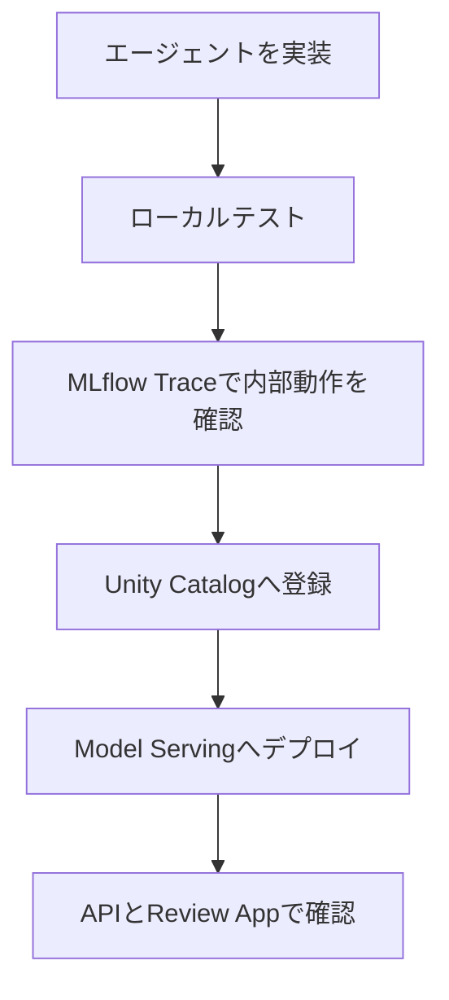
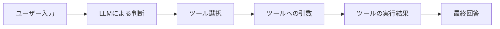
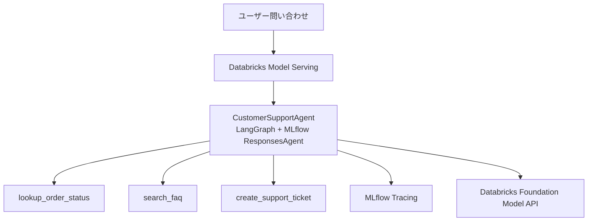
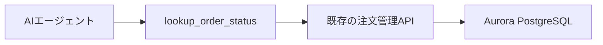
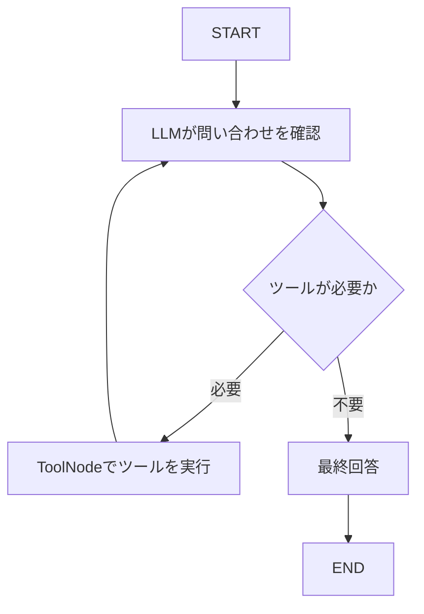
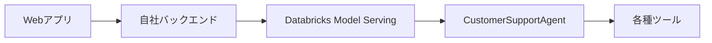
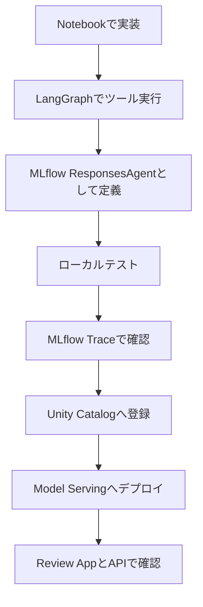

## はじめに

AIエージェントを作ること自体は、以前より簡単になりました。

LLMにツールを渡し、ユーザーの質問に応じて検索やAPI呼び出しを実行させれば、簡単なエージェントは比較的短いコードで構築できます。

一方、実際のサービスで利用するには、次のような課題があります。

- なぜその回答を返したのか確認できない
- どのツールを選択したのかわからない
- ツールにどの引数を渡したのか追跡できない
- プロンプトやモデルの変更による影響を比較できない
- ローカルで動いたコードを本番環境へ公開するのが大変
- 本番で起きた失敗を改善につなげにくい

こうした、AIエージェントの開発、記録、評価、デプロイ、監視、改善を継続的に行うための取り組みが **AgentOps** です。

この記事では、Databricks上でカスタマーサポートAIエージェントを構築し、以下の流れを一通り試します。



:::message
この記事で使用しているDatabricks NotebookはGitHubで公開しています。Databricks Workspaceへインポートして、そのままハンズオンを試せます。
:::

https://github.com/aymkbyshi/databricks-agentops-customer-support

今回の目的は、高度なカスタマーサポートシステムを完成させることではありません。

> Databricksを使うと、AgentOpsの基本的なライフサイクルをどこまで短い距離で体験できるのか。

これを確認することが目的です。

## AgentOpsで管理したいもの

一般的なAPIでは、エラー率、レイテンシー、HTTPステータスなどを監視します。

AIエージェントでは、それだけでは不十分です。

たとえば、エージェントが次の回答を返したとします。

> ご注文は配送中で、2026年7月20日に到着予定です。

文章としては自然です。しかし、本当に確認したいのは次の点です。

- 注文検索ツールを呼び出したか
- 正しい注文番号を渡したか
- ツールから取得した到着予定日を使ったか
- モデルが到着日を推測していないか
- ツール呼び出しに何秒かかったか
- 途中でエラーが発生していないか

AgentOpsでは、最終回答だけでなく、回答に至るまでの処理全体を管理します。



今回のサンプルでは、この一連の処理をMLflow Traceで確認します。

## 今回作るカスタマーサポートAI

エージェントには、次の3つのツールを用意します。

| ツール | 役割 |
| ---- | ---- |
| `lookup_order_status` | 注文番号から注文状況を確認する |
| `search_faq` | 返品、配送、支払い、保証などのFAQを検索する |
| `create_support_ticket` | AIだけでは解決できない問い合わせのチケットを作成する |

ユーザーは、たとえば次のように質問します。

```text
注文ORD-001の配送状況を教えてください
```

```text
返品ポリシーを教えてください
```

```text
届いた商品が壊れていました。
サポートチケットを作成してください
```

LLMは質問内容に応じて、利用するツールを自動的に選択します。

## 全体アーキテクチャ



デモでは注文情報やFAQをPython上のモックデータとして保持します。

実際のプロダクトでは、ツールの内部を既存のAurora、PostgreSQL、業務API、FAQ検索基盤などへ差し替えられます。



Databricksを導入するからといって、既存のAuroraを置き換える必要はありません。

| コンポーネント | 主な役割 |
| ---- | ---- |
| Aurora・既存API | 業務データ、認証、認可、更新処理 |
| AIエージェント | 質問理解、ツール選択、回答生成 |
| MLflow | トレース、実験記録、モデル管理 |
| Unity Catalog | エージェントの登録とバージョン管理 |
| Model Serving | エージェントをAPIとして公開 |

## 1. 必要なパッケージをインストールする

```python:01_install_packages.py
%pip install -U \
    mlflow==3.6.0 \
    databricks-langchain==0.8.2 \
    langgraph==0.3.4 \
    langchain-core==0.3.86 \
    databricks-agents \
    pydantic==2.12.5 \
    -q

dbutils.library.restartPython()
```

主な役割は次のとおりです。

| パッケージ | 役割 |
| ---- | ---- |
| `mlflow` | ResponsesAgent、Tracing、モデル登録 |
| `langgraph` | エージェントの処理フローを構築 |
| `databricks-langchain` | DatabricksのLLM EndpointをLangChainから利用 |
| `databricks-agents` | Model Servingへのデプロイ |
| `pydantic` | 入出力データの型管理 |

:::message alert
ライブラリの組み合わせは更新される可能性があります。利用中のDatabricks Runtimeと各パッケージの互換性を確認してください。
:::

## 2. 登録先とMLflow Experimentを設定する

```python:02_configuration.py
CATALOG = "main"
SCHEMA = "your_schema"

MODEL_NAME = f"{CATALOG}.{SCHEMA}.customer_support_agent"
AGENT_ENDPOINT_NAME = "customer-support-agent"
LLM_ENDPOINT = "databricks-meta-llama-3-3-70b-instruct"
```

続いて、MLflow Experimentを明示的に設定します。

```python:02_configuration.py
import mlflow

try:
    username = (
        dbutils.notebook.entry_point
        .getDbutils()
        .notebook()
        .getContext()
        .userName()
        .get()
    )
except Exception:
    username = "your-email@databricks.com"

MLFLOW_EXPERIMENT_NAME = (
    f"/Users/{username}/customer-support-agent"
)

mlflow.set_experiment(MLFLOW_EXPERIMENT_NAME)
```

Experimentを明示することで、ローカルテストで記録したTraceとモデル登録時のRunを同じ場所に集約できます。

## 3. エージェントファイルを作成する

MLflowへModels from Code形式で登録するため、エージェントの実装を`agent.py`として書き出します。

```python:03_create_agent.py
%%writefile /tmp/agent.py
```

完成コードは長いため、GitHubのNotebookを参照してください。

https://github.com/aymkbyshi/databricks-agentops-customer-support/blob/main/notebooks/customer_support_agent.py

実装の中心は次の3点です。

### ツールを定義する

```python
@tool
def lookup_order_status(order_id: str) -> str:
    ...

@tool
def search_faq(query: str) -> str:
    ...

@tool
def create_support_ticket(
    customer_name: str,
    issue_summary: str,
    priority: str = "medium",
) -> str:
    ...
```

### LangGraphでツール実行ループを作る



### MLflow ResponsesAgentとして公開する

```python
class CustomerSupportAgent(ResponsesAgent):
    def predict(self, request):
        ...

    def predict_stream(self, request):
        ...
```

`mlflow.langchain.autolog()`を有効にすることで、LLM呼び出しやツール実行がTraceとして記録されます。

## 4. ローカルでテストする

```python:04_local_test.py
from agent import AGENT
from mlflow.types.responses import ResponsesAgentRequest

def test_agent(question: str) -> None:
    request = ResponsesAgentRequest(
        input=[
            {
                "role": "user",
                "content": question,
            }
        ]
    )

    response = AGENT.predict(request)
    print(response)
```

3種類の問い合わせを実行します。

```python
test_agent("注文ORD-001の配送状況を教えてください")
test_agent("返品ポリシーを教えてください")
test_agent(
    "届いた商品が壊れていました。"
    "乱橋太郎としてサポートチケットを作成してください"
)
```

| テストケース | 期待するツール |
| ---- | ---- |
| 注文状況の確認 | `lookup_order_status` |
| 返品ポリシー | `search_faq` |
| 破損商品の問い合わせ | `create_support_ticket` |

## 5. MLflow Traceで内部動作を見る

ここが、今回のハンズオンで最も重要なAgentOpsの体験です。

ローカルテストを実行すると、LLM呼び出しやツール実行がTraceとして記録されます。

```python:09_inspect_traces.py
experiment = mlflow.get_experiment_by_name(
    MLFLOW_EXPERIMENT_NAME
)

traces = mlflow.search_traces(
    experiment_ids=[experiment.experiment_id],
    max_results=10,
)

display(traces)
```


*複数の問い合わせについて、リクエスト、レスポンス、トークン数、実行時間、ステータスを一覧で確認できる*

Trace一覧から1件を開くと、ツール選択、引数、戻り値、最終回答まで確認できます。


*LLMがlookup_order_statusを選択し、ORD-001を引数として渡した後、ツール結果を使って回答を生成している*

Traceで見るべきポイントは次のとおりです。

1. LLMがどのツールを選択したか
2. ツールへ渡した引数
3. ツールから返された値
4. 各処理にかかった時間
5. エラーの有無
6. 最終的に生成された回答

:::message
最終回答だけを見ると、モデルが注文情報を推測したのか、実際にツールを実行したのか判断できません。Traceを確認することで、ツール選択、引数、戻り値、最終回答までを一続きで追跡できます。
:::

## 6. Unity Catalogのスキーマを用意する

```python:05_create_schema.py
from databricks.sdk import WorkspaceClient
from databricks.sdk.errors import NotFound

workspace = WorkspaceClient()

try:
    workspace.schemas.get(f"{CATALOG}.{SCHEMA}")
except NotFound:
    workspace.schemas.create(
        name=SCHEMA,
        catalog_name=CATALOG,
    )
except Exception as error:
    raise RuntimeError(
        f"スキーマ確認中にエラーが発生しました: {error}"
    ) from error
```

`NotFound`と権限不足・通信障害などを分けて扱うことで、エラー原因を明確にできます。

## 7. エージェントをMLflowへ記録する

```python:06_log_model.py
from mlflow.models.resources import DatabricksServingEndpoint

mlflow.set_registry_uri("databricks-uc")

resources = [
    DatabricksServingEndpoint(
        endpoint_name=LLM_ENDPOINT
    )
]

input_example = {
    "input": [
        {
            "role": "user",
            "content": "注文ORD-001の状況を教えてください",
        }
    ]
}

with mlflow.start_run(
    run_name="customer-support-agent"
):
    model_info = mlflow.pyfunc.log_model(
        name="agent",
        python_model="/tmp/agent.py",
        resources=resources,
        pip_requirements=[
            "mlflow==3.6.0",
            "databricks-langchain==0.8.2",
            "langgraph==0.3.4",
            "langchain-core==0.3.86",
            "pydantic==2.12.5",
        ],
        input_example=input_example,
        registered_model_name=MODEL_NAME,
    )
```

この処理では、エージェントコード、依存関係、入力例、利用するEndpoint、MLflow Run、モデルバージョンがまとめて管理されます。

## 8. Model Servingへデプロイする

```python:07_deploy.py
from databricks import agents

deploy_info = agents.deploy(
    model_name=MODEL_NAME,
    model_version=model_info.registered_model_version,
    endpoint_name=AGENT_ENDPOINT_NAME,
    tags={
        "environment": "development",
        "use_case": "customer_support",
    },
)
```

`model_version=1`のように固定せず、今回登録されたバージョンを使います。

## 9. Endpointの起動を待つ

```python:08_wait_for_endpoint.py
import time

def wait_for_endpoint(
    name: str,
    timeout_minutes: int = 20,
) -> bool:
    deadline = time.time() + timeout_minutes * 60

    while time.time() < deadline:
        endpoint = workspace.serving_endpoints.get(
            name=name
        )

        ready = (
            endpoint.state.ready.value
            if endpoint.state and endpoint.state.ready
            else "NOT_READY"
        )

        if ready == "READY":
            return True

        time.sleep(30)

    return False
```

## 10. デプロイ済みエージェントを呼び出す

```python:10_query_endpoint.py
import mlflow.deployments

client = mlflow.deployments.get_deploy_client(
    "databricks"
)

response = client.predict(
    endpoint=AGENT_ENDPOINT_NAME,
    inputs={
        "input": [
            {
                "role": "user",
                "content": "注文ORD-003はいつ届きますか？",
            }
        ]
    },
)
```

同じ形式で、自社のバックエンドからも呼び出せます。



## 11. Review Appで業務担当者に確認してもらう

`agents.deploy`の戻り値からReview AppのURLを取得できます。

```python
print(deploy_info.review_app_url)
```

Review Appでは、カスタマーサポート担当者など、エンジニア以外のメンバーにもエージェントを試してもらえます。

確認してもらう観点の例は次のとおりです。

- 回答内容は正しいか
- 顧客にとって理解しやすいか
- 適切なツールを選択しているか
- チケットを作るべき問い合わせか
- 人間へ引き継ぐべき問い合わせではないか
- 不足しているFAQはないか

## Databricksで何が簡単になったのか

今回のハンズオンでは、次の流れを同じDatabricks環境で実行しました。



Databricksでは、AgentOpsの基本的なライフサイクルを一つの環境で体験できます。

| 確認したいこと | Databricks・MLflow上の情報 |
| ---- | ---- |
| どのように実行されたか | MLflow Trace |
| どのツールを使ったか | Tool Span |
| どのコードを登録したか | MLflow Model |
| どのバージョンか | Unity Catalog |
| どこで稼働しているか | Model Serving |
| 業務担当者の評価 | Review App |

## 実サービスへ適用する際の注意点

今回のコードは、AgentOpsを短時間で体験するためのサンプルです。

### 注文の所有権を検証する

注文番号だけで注文情報を取得できる設計は、IDOR脆弱性につながります。

本番では、認証済み顧客IDをサーバー側から注入し、注文の所有権を検証します。

### LLMへ自由なSQL実行を許可しない

用途を限定したツールや業務APIを用意し、AIには利用するツールだけを選択させます。

### 更新処理には確認や承認を入れる

返金、注文キャンセル、契約変更、チケット作成などには確認画面や承認フローを入れます。

### 個人情報をTraceへ残さない

氏名、メールアドレス、住所、決済情報、アクセストークンなどはマスキングします。Traceの閲覧権限と保存期間も設定します。

### ツール呼び出し回数に上限を設ける

サンプルでは`recursion_limit`を設定し、LLMがツールを無限に呼び続ける事態を防いでいます。

## 次に試したいAgentOps

次のステップでは、評価データセットと品質ゲートを追加します。

```python
QUALITY_GATE = {
    "tool_selection_accuracy": 0.95,
    "tool_argument_accuracy": 0.95,
    "answer_correctness": 0.90,
    "groundedness": 0.95,
    "escalation_accuracy": 0.98,
    "cross_customer_leakage": 0.00,
    "unsafe_action_rate": 0.00,
}
```

本番で発生した失敗を評価データセットへ追加し、プロンプト、ツール、FAQ、モデルを改善するループにつなげます。

## まとめ

AIエージェントを作るだけなら、それほど難しくありません。

難しいのは、エージェントを継続的に運用し、改善できる状態にすることです。

今回のハンズオンでは、Databricks上で次の流れを体験しました。

- LangGraphでツール実行型エージェントを作成
- MLflow ResponsesAgentとして定義
- Notebook上でローカルテスト
- MLflow Traceで内部動作を確認
- Unity Catalogへモデルを登録
- Model Servingへデプロイ
- APIとReview Appから動作を確認

Databricksの価値は、LLMを呼び出せることだけではありません。

**エージェントの開発、記録、Tracing、登録、デプロイ、レビューを、一続きのAgentOpsライフサイクルとして試せること**にあります。

まずは1つの小さなエージェントと、数個のモックツールから始めれば十分です。

この記事で使用したNotebookは、以下のGitHubリポジトリで公開しています。

https://github.com/aymkbyshi/databricks-agentops-customer-support
